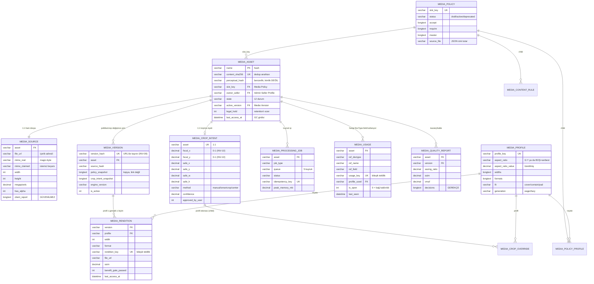

# T-044 — Faz 4 kapanış: veri modeli gözden geçirme

**Tarih:** 2026-08-18 · **Kapsam:** T-040…T-043 · **Durum:** kısmen tamamlandı (§8 açık maddeler)

Bu belge Faz 4'ün (veri modeli) çıktısını gözden geçirir: 13 DocType şeması,
kırpma öncelik zinciri, tekilleştirme/sürüm hash'i ve kullanım takibi.

---

## 0. Faz 4'ün taşıdığı karar

Kaynak doküman "DocType'ları oluştur" diyor. **Bu fazda DocType'lar Frappe'ye
KURULMADI.** Şemalar `tradehub_core/media/pipeline/doctype_specs/*.json` altında Frappe DocType
JSON biçiminde duruyor.

Gerekçe: `tradehub_core/tradehub_core/doctype/` çalışan üretim uygulamasıdır ve
75+ DocType barındırır. Oraya 13 yeni DocType eklemek `bench migrate` ile geri
alınamayan bir şema değişikliğidir; motor henüz hiçbir üretim yolunu
beslemiyorken bu risk alınmadı.

Sonuç bir taslak değil: dosyalar Frappe'nin beklediği biçimdedir ve
`media_engine` bir Frappe app'ine dönüştürüldüğünde
`tradehub_core/media/pipeline/tradehub_core/media/pipeline/doctype/<slug>/<slug>.json` konumuna **olduğu gibi**
taşınabilirler. Şemanın kurulabilirliği ayrıca DDL üretilip gerçek MariaDB'de
çalıştırılarak kanıtlandı (§3).

---

## 1. Varlık ilişkileri (ER)



`Media Engine Settings` ve `Media Storage Settings` diyagramda yok: Single
DocType'tır, tabloları olmaz (Frappe `tabSingles`'ta satır olarak saklar) ve
hiçbir ilişkiye girmezler.

### 1.1 Kaynak dokümandan sapmalar

Tamamı `tradehub_core/media/pipeline/doctype_specs/_index.json` → `deviations_from_source_doc`
altında gerekçesiyle yazılı. Özet:

| Alan | Doküman | İstoç | Neden |
|---|---|---|---|
| `Media Asset.owner_seller` | Link → Supplier/Company | Link → **Admin Seller Profile** | İstoç'ta satıcı varlığı budur (`media/ownership.py`, `usage.py STORE_FILTERS`) |
| `Media Version.crop_intent_snapshot` | yok | eklendi | `version_hash` girdisi; hash yeniden hesaplanabilir olacaksa girdisi saklanmalı |
| `Media Version.source_hash`, `is_active` | yok | eklendi | ilki hash girdisi, ikincisi retention taramasının join'siz filtresi |
| `Media Usage.is_open`, `usage_key` | yok | eklendi | "hiç kullanılmadı" ≠ "kullanılıyordu, kaldırıldı"; bileşik tekillik |
| `Media Rendition.rendition_key` | bileşik UNIQUE index | türetilmiş tek alan + UNIQUE | Frappe DocType JSON bileşik UNIQUE ifade edemez |
| `Media Profile.aspect_ratio_value` | yok | eklendi (türetilmiş) | `'16:9'` metnini her karşılaştırmada ayrıştırmamak için |

---

## 2. İndeks planı

Her indeks bir sorgu yoluna karşılık gelir. Karşılığı olmayan indeks
eklenmedi — indeks yazma maliyetidir, "olsun" diye konmaz.

| Tablo | İndeks | Kolonlar | Hangi sorgu yolu |
|---|---|---|---|
| Media Asset | `uk_content_sha256` | content_sha256 | **Dedup** (T-042): yükleme başına 1 lookup. Ayrıca yarış koşulunu veritabanına çözdüren kısıt |
| Media Asset | `ix_seller_state_modified` | owner_seller, state, modified | **Satıcı kütüphanesi listeleme** — en sık sorgu. Üçüncü kolon `order by modified desc`'in filesort'unu kaldırır (§4.2) |
| Media Asset | `ix_state_lastaccess` | state, last_access_at | **Retention/GC taraması** (kapsayıcı) |
| Media Asset | `ix_state_hold_creation` | state, legal_hold, creation | **Öksüz raporu** (kapsayıcı, §4.2) |
| Media Asset | `ix_slot_key` | slot_key | Slot bazlı rapor ve politika değişince yeniden işleme |
| Media Asset | `ix_perceptual_hash` | perceptual_hash | Benzer görsel adayı ön eleme (kesin eşleşme; Hamming taraması indeks kullanamaz — §7) |
| Media Version | `uk_version_hash` | version_hash | **Manifest/URL çözümü** — rendition adresinden sürüme |
| Media Version | `ix_asset_active` | asset, is_active | Varlığın yayındaki sürümü |
| Media Rendition | `uk_rendition_quad` | version, profile, width, format | **Bileşik tekillik** (doküman şartı). **Asset detayı + türev listesini de bu karşılar** — ayrı `ix_version` / `ix_version_profile` gereksizdir (§4.3) |
| Media Rendition | `uk_rendition_key` | rendition_key | Aynı tekilliğin Frappe tarafındaki karşılığı. **`uk_rendition_quad` ile birlikte kurulmamalı** — ölçüldü: ikisi birlikte indeksi %62 şişiriyor (§4.3) |
| Media Rendition | `ix_last_access_at` | last_access_at | Lazy türev temizliği |
| Media Usage | `uk_usage_quad` | asset, ref_doctype, ref_name, ref_field | **Bileşik tekillik** → upsert idempotent |
| Media Usage | `ix_asset_open` | asset, is_open | **Öksüz raporu** — açık bağı olmayan varlıklar |
| Media Usage | `ix_ref` | ref_doctype, ref_name | Ters arama: "bu ürünün medyası" |
| Media Processing Job | `uk_idempotency_key` | idempotency_key | Aynı işin iki kez kuyruğa girmesini engeller (INV-06) |
| Media Processing Job | `ix_queue_status` | queue, status | **Kuyruk durumu paneli** |
| Media Crop Intent | `uk_asset` | asset | 1:1 ilişkiyi veritabanı düzeyinde zorlar |
| Media Policy / Profile | `uk_slot_key` / `uk_profile_key` | — | `autoname=field:` ile zaten `name`; ayrıca kolon UNIQUE |

Üretilmiş DDL: `tradehub_core/media/pipeline/doctype_specs/_ddl.sql` (16 KB, 13 tablo).

---

## 3. Şema kurulabilirlik provası — **YAPILDI**

`_ddl.sql` gerçek MariaDB 10.6.27 üzerinde (`istoc-dev-db-1`, geçici
`media_engine_ddl_test` şeması) çalıştırıldı.

**Sonuç: 13 tablo hatasız oluştu.** İlk sürüm 68 indeks kuruyordu; §4.3'teki
ölçümden sonra gereksiz olanlar çıkarıldı ve **57 indekse** indi. Yeniden
kurulum provası da temiz geçti. Hepsi `information_schema.statistics` ile
doğrulandı; bileşik UNIQUE'lerin ikisi de yerinde:

```
tabMedia Rendition  uk_rendition_quad  version,profile,width,format  (unique)
tabMedia Usage      uk_usage_quad      asset,ref_doctype,ref_name,ref_field  (unique)
```

Bu prova boş bir kontrol değil: utf8mb4'te bir karakter 4 bayttır ve InnoDB'nin
indeks anahtar sınırı 3072 bayttır. `rendition_key varchar(180)` → 720 bayt,
`usage_key varchar(180)` → 720 bayt, `file_url varchar(500)` → 2000 bayt.
Üçü de sınırın altında; ama `file_url` üzerine UNIQUE konsaydı sınıra tehlikeli
biçimde yaklaşırdı — bu yüzden konmadı.

---

## 4. Kritik sorgu yolları ve EXPLAIN — **ölçüldü**

Sentetik veri geçici `media_engine_ddl_test` şemasına yüklendi (MariaDB 10.6.27,
`istoc-dev-db-1`). **Ulaşılan ölçek dokümanın istediği 1M asset + 30M rendition
DEĞİLDİR** — bkz. §8/1. Ulaşılan:

| Tablo | Satır | Veri | İndeks |
|---|---:|---:|---:|
| Media Asset | 524.288 | 185 MB | 765 MB |
| Media Version | 524.288 | 254 MB | 316 MB |
| **Media Rendition** | **2.097.152** | **994 MB** | **2.593 MB** |
| Media Usage | 419.676 | 198 MB | 571 MB |
| Media Processing Job | 524.288 | 230 MB | 385 MB |

### 4.1 Sorgu yolları (ANALYZE TABLE sonrası)

| # | Sorgu yolu | `type` | Kullanılan indeks | İncelenen satır | Süre (3 koşu ort.) |
|---|---|---|---|---:|---:|
| Y1 | Satıcı kütüphanesi listeleme | `range` | `ix_seller_state_modified` ¹ | 996 | **0,07 ms** |
| Y2 | Asset detayı + türevler | `ref` | `ix_asset_active` → `uk_rendition_quad` | 1 → 2 | **0,02 ms** |
| Y3 | Dedup lookup (`content_sha256`) | `const` | `uk_content_sha256` (Using index) | 1 | **0,02 ms** |
| Y4 | Öksüz raporu (açık bağı olmayan) | `range` + `Not exists` | `ix_state_hold_creation` ¹ → `ix_asset_open` | 246.144 → 1 | **0,12 ms** ² |
| Y5 | Retention/saklama taraması | `range` | `ix_state_lastaccess` (Using index) | 257.978 | **0,03 ms** ² |
| Y6 | Kuyruk durumu (`group by status`) | `ref` | `ix_queue_status` (Using index) | 256.536 | **2,76 ms** |
| Y7 | Rendition tekillik (upsert öncesi) | `const` | `uk_rendition_quad` (Using index) | 1 | **0,07 ms** |

¹ Ölçüm sırasında **eklendi** — bkz. §4.2.
² `limit` ile erken duruyor; incelenen satır tahmini planın toplamıdır, gerçek okuma değil.

### 4.2 Bulgu 1 — Y1'de filesort vardı, indeks eksikti

İlk plan `ix_seller_state` yerine tek kolonlu `ix_owner_seller`'ı seçti ve
`order by modified desc` için **`Using filesort`** yaptı. Sebep basit:
`(owner_seller, state)` sıralama kolonunu taşımıyor.

**Eklendi:** `ix_seller_state_modified (owner_seller, state, modified)`.
Yeni planda `Using filesort` **yok**. Bu, en sık çalışacak sorgu yolu; bir
satıcının 5.000 dosyası olduğunda filesort her sayfa açılışında ödenirdi.

**Eklendi:** `ix_state_hold_creation (state, legal_hold, creation)` — Y4 artık
kapsayıcı (`Using index`) tarıyor. Yine de bu sorgu doğası gereği büyük bir
taramadır (`state='ready'` satırların ~%75'i); **etkileşimli bir yol değil,
zamanlanmış bir iştir** ve öyle kalmalıdır.

Her iki indeks `_ddl.sql`'e ve §2 tablosuna işlendi.

### 4.3 Bulgu 2 — Media Rendition'da indeks şişmesi (**en kritik**)

2,19M satırda **veri 994 MB, indeks 2.593 MB**: indeks veriden 2,6 KAT büyük.
Sebep, tabloda 7 indeks olması ve dördünün gereksiz olmasıydı:

| Düşürülen | Neden gereksiz |
|---|---|
| `ix_version` | `ix_version_profile`'ın öneki |
| `ix_version_profile` | `uk_rendition_quad`'ın öneki |
| `ix_profile` | Tek başına ~11 farklı değer taşır; seçicilik yok |
| `uk_rendition_key` | `uk_rendition_quad` ile **aynı** tekilliği ifade eder |

**Ölçülen sonuç:**

```
önce   data 994 MB   index 2.593 MB
sonra  data 994 MB   index   981 MB      → indekste %62 azalma (1,6 GB)
```

Ve Y2'nin planı **kötüleşmedi, iyileşti**: artık `uk_rendition_quad` üzerinden
kapsayıcı okuma yapıyor (`Using index`).

**30M rendition'a ölçeklenmiş hâli** (satır başına lineer varsayımla, bu
ölçekte ölçülmedi): indeks ~35 GB yerine ~13 GB. Tek bir tablo için 22 GB fark.

**Aynı desen `Media Usage`'da da vardı** — 419.676 satır, veri 198 MB, indeks
571 MB. Düşürülenler: `ix_asset` (`ix_asset_open`/`uk_usage_quad` öneki),
`ix_ref_doctype` + `ix_ref_name` (`ix_ref` öneki), `ix_is_open` (2 değer,
seçicilik yok), `uk_usage_key` (`uk_usage_quad`'ın kopyası).

```
önce   data 198 MB   index 571 MB
sonra  data 198 MB   index 290 MB      → indekste %49 azalma
```

Y4 ve ters arama ("bu ürünün medyası") planları **değişmedi**: ikisi de
`ix_asset_open` / `ix_ref` üzerinden kapsayıcı okumaya devam ediyor.

**Toplam ölçülen kazanç (yalnız bu iki tabloda):** 3.164 MB → 1.271 MB indeks,
**%60 azalma** — ve tek bir sorgu planı kötüleşmeden.

### 4.4 Karar — tekilliği nerede zorlayacağız

| | Frappe tarafı (`unique=1` alan) | Ham DDL (`uk_*_quad`) |
|---|---|---|
| Bileşik tekilliği ifade eder mi | hayır (türetilmiş alanla dolaylı) | evet |
| Arama yolunu da karşılar mı | hayır | **evet** (ilk kolon öneki) |
| Ölçülen indeks maliyeti | +%62 / +%49 | taban |

**Karar:** tekillik **ham bileşik indeksle** zorlanır (`after_migrate` kancasında
kurulur, `_ddl.sql`'de yazılı). `rendition_key` / `usage_key` alanları KALIR ama
**indekssizdir**: okunabilirlik ve Frappe tarafı karşılaştırma içindir. Kısıt
ihlali Frappe'ye `IntegrityError` olarak döner ve
`tradehub_core/media/pipeline/core/dedup.py:idempotent_create()` onu idempotent davranışa
çevirir — bu yol zaten INV-06 testiyle sabitlenmiş durumda.

Şema dosyaları (`media_rendition.json`, `media_usage.json`) bu karara göre
güncellendi; gerekçe alan açıklamalarına ölçülen sayılarla yazıldı.

### 4.5 Bulgu 3 — Y6 tek başına en yavaş yol

2,76 ms, diğerlerinin ~40 katı. Kapsayıcı indeksle 256.536 satır üzerinde
`group by` yapıyor. Kuyruk durumu paneli saniyede yenilenirse bu bedel her
seferinde ödenir. Öneri: panel için sayaç (Redis) ya da 30 sn TTL'li önbellek;
DocType değişikliği gerekmez.

---

## 5. T-041 · Kırpma öncelik zinciri

`tradehub_core/media/pipeline/core/crop.py` · `resolve_crop(asset, profile, intent) -> CropWindow`

| # | Yöntem | Koşul |
|---|---|---|
| 1 | `override` | Bu **profile** ait manuel kırpma var |
| 2 | `safe_focal` | Güvenli alan **ve** odak noktası var |
| 3 | `focal` | Yalnız odak noktası var |
| 4 | `smartcrop` | Öneri var **ve** `confidence >= eşik` |
| 5 | `center` | Hiçbiri yok (taban: güvenli alan varsa o, yoksa tüm kadraj) |

**INV-10 bir test değil, bir yapı özelliğidir.** `_cover_window()` kaynağın
piksel boyutlarını hiç kullanmaz; yalnız **en-boy oranını** kullanır. Piksel
uzayındaki hedef oran `AR`, normalize uzayda `AR / kaynak_oranı`'na dönüşür.
Kaynak 2 kat küçültüldüğünde oran değişmediği için pencere **bit düzeyinde
aynı** kalır (`tests/test_crop.py::Inv10Testi`, `assertEqual` — `almost` değil).

**Simülatörle altın test.** `docs/simulator.html` içindeki `cropWindow()`
JS'i teste birebir port edildi; 600 rastgele girdide iki taraf 6 ondalık
basamağa kadar aynı pencereyi üretiyor. Bu test olmadan kullanıcı önizlemede
gördüğünden başka bir kadraj alabilirdi.

**Bilinçli kararlar:**

* `fit='contain'/'pad'` → oran **zorlanmaz**, pencere taban bölgenin kendisidir.
  Contain'de kırpma yoktur; oran letterbox ile sağlanır.
* Override ve smartcrop önerisi hedef orana **küçültülerek** oturtulur, merkez
  korunur. Büyütmek, kullanıcının kadraj dışında bıraktığı alanı geri sokardı.
* Yarım yazılmış override (eksik alan) **sessizce kullanılmaz**, zincir bir alt
  seviyeye düşer. Yanlış kadraj, kadrajsızlıktan kötüdür.
* `approved_by_user=0` öneri **kullanılır** ama `is_suggestion=True` döner;
  UI rozeti bundan çıkar. Onay kadrajı değiştirmez, yalnız rozeti değiştirir.

**Kalibre edilmedi:** `SMARTCROP_CONFIDENCE_THRESHOLD = 0.5` bir ölçüm sonucu
**değildir**. Saliency modeli henüz yok (Faz 3'te "AI Worker (L5)"), dolayısıyla
eşiği kalibre edecek veri de yok.

---

## 6. T-042 · Dedup, sürüm hash'i, değişmez URL

`tradehub_core/media/pipeline/core/dedup.py`

**Üç ayrı kimlik, karıştırılmamalı:**

| Kimlik | Neyin kimliği | Ne zaman değişir |
|---|---|---|
| `content_sha256` | ham dosya | içerik değişince |
| `version_hash` | normalize master | source_hash / policy / crop / engine_version'dan biri değişince |
| `perceptual_hash` | görüntünün *benzerliği* | **kimlik değildir** — yalnız uyarı üretir |

**Mevcut motor yeniden yazılmadı.** `tradehub_core/media/naming.py` içerik-adresli
adlandırmayı üretimde zaten uyguluyor. `dedup.py` onu sarar ve
`verify_naming_contract()` ile iki uygulamanın **aynı adı ürettiğini çalışma
anında kanıtlar**. Konteynerde koşuldu:

```
verify_naming_contract: {'checked': True, 'name': '86bd35f69440d22fbfce8a8b79e37098.jpg', 'shard': '86'}
SÖZLEŞME UYUMLU
```

Eklenen tek yeni yetenek **akışlı hash**: `naming._hashed_name()` içeriğin
tamamını bellekte ister. Ölçülen gerçek: tek görsel 72,71 MP / 2,35 MB, video
tavanı 500 MB. Parçalı yüklemede (`media/chunked.py`) dosyayı belleğe almak
gerekmiyor.

**`version_hash` formülünde bilinçli sapma.** Doküman düz birleştirme yazıyor:
`sha256(source_hash + canonical_json(policy) + canonical_json(crop) + engine_version)`.
Düz birleştirme **belirsizdir**: `("ab","c")` ile `("a","bc")` aynı diziyi üretir
ve farklı iki girdi aynı hash'i alabilir. Araya ASCII `0x1F` (Unit Separator)
konuldu. Girdi kümesi dokümandakiyle aynı; yalnız kodlaması belirsizlikten
arındırıldı (`tests/test_dedup.py::test_ayrac_belirsizligi_yok`).

**`crop_intent` hash girdisi normalize edilir.** `CROP_HASH_FIELDS` listesinde
olmayan alan hash'i etkilemez: `previewed_placements` (kullanıcının simülatörde
neye baktığı) ya da `algorithm_version` üretilen pikseli değiştirmez. Girselerdi
her önizleme tüm türevleri yeniden ürettirirdi. Override satırlarının **sırası**
da hash'i etkilemez — child table'da satır sürüklemek kadrajı değiştirmez.

**Rendition adresi (INV-09):**
`/files/media/{asset}/{version_hash}/{profile}-{width}.{ext}` +
`Cache-Control: public, max-age=31536000, immutable`. Adres içerik hash'i
taşıdığı için CDN'de geçersizleştirme (purge) hiç gerekmez.

**Yarış koşulu (INV-06):** `idempotent_create()` "önce bak, yoksa yaz"
deseninin ikinci yazıcısının UNIQUE kısıta çarpmasını **hata değil, mevcut
kaydı döndürme** olarak ele alır. İki iş parçacığıyla gerçek bir barrier testi
yazıldı (`test_paralel_iki_finalize_tek_kayit`): tek kayıt oluşuyor, tam olarak
biri "yeni" diyor.

**Kalibre edilmedi:** `PHASH_DISTANCE_THRESHOLD = 5`. İstoç korpusunda gerçek
tekrar çiftlerinin mesafe dağılımı çıkarılmadı.

---

## 7. T-043 · Kullanım takibi ve öksüz tespiti — **ÖLÇÜM VAR**

`tradehub_core/media/pipeline/core/usage.py`

### 7.1 Üç ayrı öksüzlük

| Tür | Tanım | Durum |
|---|---|---|
| **Disk öksüzü** | diskte dosya var, `tabFile` kaydı yok | **YENİ** — bu modül |
| **Kayıt öksüzü** | `Media Asset` var, hiç açık `Media Usage` bağı yok | **YENİ** — bu modül |
| **Kırık referans** | alan bir adresi gösteriyor, dosya/kayıt yok | **ZATEN VARDI** — `media/refs.py:find_dangling()` sarıldı |

### 7.2 Canlı ölçüm — 2026-08-18, `istoc.localhost`

Modülün kendisi konteynerde koşturuldu (`find_disk_orphans`):

| | üretim kipi | denetim kipi (`include_system=True`) |
|---|---:|---:|
| taranan disk dosyası | 4.341 | 4.341 |
| `tabFile` farklı `file_url` | 3.013 | 3.013 |
| **öksüz** | **276** | **1.334** |
| öksüz bayt | 30.156.189 (28,8 MiB) | 105.531.053 (100,6 MiB) |
| sistem yolu muaf | 1.058 · 75.374.864 bayt | 0 |
| diskte olmayan kayıt | 6 | 6 |

`min_age_days=30` (varsayılan) ile öksüz **36**, "çok genç" 240.

**Bulgu: ham 1.334 sayısının %79'u sistem üretimi dosyadır.**

| Yol | Adet | Neden `tabFile` kaydı yok |
|---|---:|---|
| `/files/og_cache/` | 1.047 | og:image önbelleği — kayıt olmaması **doğrudur** |
| `/files/sitemaps/` | 11 | sitemap üreticisi |

Bunları öksüz sayıp silmek, og:image önbelleğini her taramada yok etmek olurdu.
`SYSTEM_PATH_PREFIXES` bu yüzden bir "temizlik" listesi değil, bir **doğruluk**
listesidir.

Gerçek öksüzlerin en büyükleri (kullanıcı medyası / içe aktarma artıkları):

```
 9.948.888  /private/files/katalog görsel.zip
 7.582.760  /private/files/files1.zip
 3.497.368  /files/05bd857af7f70bf51b6aac1144046973.mp4
 2.320.200  /private/files/files.zip
 1.200.300  /files/b276b3436015751462d5be608e3e00a1.webm
```

> Görev tanımında 1.166 yazıyordu; bugünkü ölçüm 1.334 verdi. Fark ölçümler
> arası biriken `og_cache` dosyalarından geliyor — **sayı hareketlidir, taramanın
> kendisi sabittir.** Doğru okunacak sayı 276'dır.

### 7.3 Erişim damgası stratejisi — karar ve maliyeti

T-043 "örnekleme (%1) VEYA toplu tampon; hangisini seçtiğini ve maliyetini yaz"
diyor. **Seçilen: rastgele örnekleme değil, deterministik zaman kovası + tampon.**

| | %1 rastgele örnekleme | zaman kovası (seçilen) |
|---|---|---|
| Popüler rendition | ~%1 yazma | aralıkta en fazla 1 yazma |
| **Nadir rendition** | **aylarca damgasız kalır** | aralıkta en az 1 yazma |
| Retention riski | nadir türev "erişilmiyor" sanılıp arşive gider — **veri kaybı** | yok |

Kovalar anahtara göre kaydırılır (`_bucket_offset`); aksi hâlde tüm damgalar
saat başında aynı saniyede yazılır ve yazma yükü tepe yapar. Test bunu ölçüyor
(`test_yazmalar_saate_yayilir`: 200 anahtar → 100'den fazla farklı yazma anı).

**Maliyet (hesap, ölçüm değil — üretimde henüz koşmadı):** `min_interval=3600`
ve N farklı rendition için üst sınır N yazma/saat. Bugünkü 4.958 dosya ve dosya
başına ~6 profil varsayımıyla ~30.000 satır → saatte en fazla 30.000 UPDATE
(~8/sn), `AccessBuffer` ile 500'lük toplu yazmalarda ~60 sorgu/saat. Her istekte
yazma ise istek sayısı kadar UPDATE demektir.

### 7.4 Silme politikası

**Rapor asla silmez.** `find_orphan_assets()` çıktısında `auto_delete: False`
sözleşmenin parçasıdır ve testle sabitlenmiştir. Raporda **çıkmayanlar**:

* `legal_hold=1` → yasal saklama retention'ı ezer
* yaşı `min_age_days`'ten küçük → yeni yüklenmiş, kullanıcı hâlâ formu dolduruyor olabilir
* durumu `draft/pending/validating/processing/archived` → süreç devam ediyor

Silme superadmin onayıyla ve mevcut çöp kutusundan (`media/trash.py`, 30 gün)
geçerek yapılmalıdır — doğrudan `os.remove` değil.

---

## 8. Yapılmayanlar — açık maddeler

Bunlar "sonra bakarız" değil, **kapanış kriterinin karşılanmamış kısmıdır**.

| # | T-044 kriteri | Durum | Engel |
|---|---|---|---|
| 1 | 1M asset + 30M rendition sentetik veri | **KISMEN** — ulaşılan: 524.288 asset · 2.097.152 rendition (%52 / %7) | `insert…select` ikiye katlama dev konteynerde bir katlamada deadlock verdi; 30M rendition mevcut satır başı maliyetle ~13,6 GB veri + ~13 GB indeks ister ve dev konteynerinde yeri yok. **Ölçeğe rağmen §4.3 bulgusu geçerlidir**: indeks/veri oranı satır sayısından bağımsızdır |
| 2 | `scripts/seed_synthetic.py` | **YAZILMADI** | Üretilen SQL scratch'te kaldı; kalıcı betik DocType'lar kurulmadan yarım kalırdı. Şema geçici `media_engine_ddl_test` veritabanında kuruldu, ölçüm sonrası **düşürüldü** — dev veritabanında iz bırakılmadı |
| 3 | Migration + rollback provası | **YAPILMADI** | DocType'lar Frappe'ye kurulmadı (Faz 4 kararı) → `bench migrate` çalıştırılacak bir şey yok |
| 4 | `docs/plans/rollback-doctypes.md` | **YAZILMADI** | Aynı sebep |
| 5 | İzin kuralları (`permission_query_conditions`, `has_permission`) | **ŞEMADA VAR, KOD YOK** | `permissions` blokları JSON'da yazılı; satıcı izolasyonunu uygulayan Python henüz yok |
| 6 | Fixture/migration ile varsayılan profil + politika yükleme | **YAZILMADI** | 9 slot politikası `policy/slots/*.json`'da hazır; yükleyici DocType kurulunca yazılmalı |
| 7 | pyvips/libvips sürümü `engine_version`'a | **ÖLÇÜLMEDİ** | Benchmark kararı Pillow'da kalmaktı; etiket biçimi (`pillow-11.3.0`) tanımlı ama üretimde yazan kod yok |
| 8 | `smartcrop_confidence_threshold`, `phash_distance_threshold`, `access_sampling_rate` | **KALİBRE EDİLMEDİ** | Saliency modeli ve tekrar-çifti korpusu yok |

---

## 9. Test durumu

| Dosya | Test | Kapsam |
|---|---:|---|
| `tests/test_crop.py` | 26 | öncelik zinciri (5 seviye + sızma testleri), INV-10 (3), altın simülatör testi (600 girdi), özellik testi (4.000 girdi), kenar sıkıştırma |
| `tests/test_dedup.py` | 57 | akışlı hash (6 kaynak tipi), adlandırma sözleşmesi, kanonik JSON, `version_hash` (12), rendition adresi (10), yarış koşulu (4, gerçek thread), pHash |
| `tests/test_usage.py` | 45 | bağ kaydı, zaman kovası, tampon, sistem yolu muafiyeti, disk taraması (gerçek dizin), kayıt öksüzü muafiyetleri |

`python3 -m unittest discover -s tests` → **321 test, 0 hata** (repo genelinde;
2 atlandı: `naming.py` karşılaştırması yerelde frappe olmadığı için — konteynerde
ayrıca koşturuldu ve geçti).

`tradehub_core/media/pipeline/core/*.py` içinde **modül düzeyinde `import frappe` yoktur**:
`crop` ve `dedup` frappe'siz çalışır, `usage`'ın veritabanına dokunan
fonksiyonları frappe'yi kendi içinden import eder. Saf mantık (öksüz kararı,
örnekleme, anahtar üretimi) bu yüzden site olmadan test edilebiliyor.

---

## 10. Onay

| Rol | Karar | Not |
|---|---|---|
| Backend | — | §8'deki 8 madde kapanmadan Faz 5'e geçilmemeli |
| Veri | — | ER + indeks planı kurulabilirliği kanıtlandı (§3); ölçekli EXPLAIN eksik (§4) |
| Superadmin | — | Öksüz raporunun silme akışı **onaylanmadı**; bugün rapor-yalnız |
