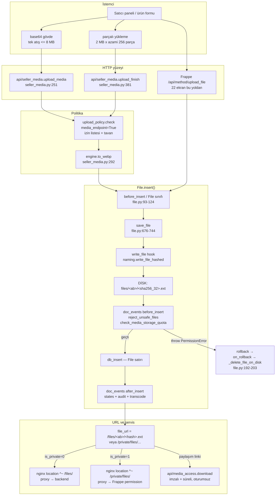

# 01 — Frappe File akışı: yükleme → kayıt → disk → URL

**Görev:** T-002 · **Tarih:** 2026-08-17 · **Branch:** `medya-motoru-faz0-faz2`
**Kapsam:** Bir dosyanın istemciden diske ve oradan tarayıcıya dönene kadarki tam yolu;
İstoç'un bu yola hangi noktalardan girdiği; nerede genişletilebileceği.

> Bu rapor **mevcut kodu belgeler**, yeni tasarım önermez. Sayıların her biri
> `dosya:satır` ile işaretlidir. Ölçüm gerektirip yapılamayanlar §9'da.

---

## 0. Kaynak dosyalar ve satır sayıları

`wc -l` çıktısı (2026-08-17, worktree `/Users/ahmet/Desktop/istoc-medya-wt`):

| Dosya | Satır | Rol |
|---|---:|---|
| `tradehub_core/media/` (27 dosya, `__init__.py` dahil) | **8 200** | medya iş mantığı |
| `tradehub_core/api/media_admin.py` | 873 | yönetim HTTP yüzeyi |
| `tradehub_core/api/seller_media.py` | 494 | satıcı HTTP yüzeyi |
| `tradehub_core/api/media_access.py` | 202 | imzalı URL |
| `tradehub_core/utils/security.py` | 145 | File kancası (uzantı + politika) |

> Ölçüm yöntemi: `wc -l tradehub_core/media/*.py tradehub_core/api/media_*.py
> tradehub_core/api/seller_media.py tradehub_core/utils/security.py`. Toplam 9 914 satır;
> `media/` paketi = toplam − (873 + 202 + 145 + 494) = 8 200.

Frappe tarafı okunan kaynak (konteyner imajından, salt-oku):
`/Users/ahmet/OrbStack/docker/containers/istoc-dev-backend-1/home/frappe/frappe-bench/apps/frappe/frappe/`
— aşağıda `frappe/...` kısaltmasıyla anılır.

---

## 1. Doğrulanmış temel gerçek: disk yazımı, kancalarımızdan ÖNCE olur

Bu, akışın tamamını anlamanın anahtarıdır ve kodda iki ayrı yerden doğrulanır.

### 1.1 `File.before_insert()` içinde dosya diske yazılıyor

`frappe/core/doctype/file/file.py:93-124`:

```python
def before_insert(self):
    self.file_url = unquote(self.file_url) if self.file_url else ""
    self.set_folder_name()          # :97
    self.set_is_private()           # :98  → file_url "/private" ile başlıyorsa is_private=1
    self.set_file_name()            # :99
    self.validate_attachment_limit()# :100
    self.set_file_type()            # :101
    self.validate_file_extension()  # :102  → System Settings.allowed_file_extensions
    ...
    if self.is_remote_file:
        self.validate_remote_file()
    else:
        self.save_file(content=self.get_content())   # :120  ← DİSKE YAZAR
        self.flags.new_file = True                   # :121
        frappe.db.after_rollback.add(self.on_rollback)  # :122
    self.validate_duplicate_entry()                  # :124
```

`save_file()` (`file.py:676-744`) zinciri: EXIF strip (`:704-709`) → `file_size`
hesapla (`:711`) → `content_hash` üret (`:712`) → tekilleştirme sorgusu (`:715-731`)
→ dosya yoksa `write_file` hook'unu çağır (`:741-744`).

### 1.2 `doc_events` kancaları BUNDAN SONRA çalışıyor

`frappe/model/document.py:1356-1364` — `compose()`:

```python
def compose(fn, *hooks):
    def runner(self, method, *args, **kwargs):
        add_to_return_value(self, fn(self, *args, **kwargs))   # :1358  ÖNCE sınıfın kendi metodu
        for f in hooks:                                        # :1359  SONRA app hook'ları
            add_to_return_value(self, f(self, method, *args, **kwargs))
        return self.__dict__.pop("_return_value", None)
    return runner
```

`composer()` (`document.py:1366-1376`) `frappe.get_doc_hooks()` ile
`doc_events["File"]["before_insert"]` listesini toplar ve **`fn`'den sonra** çalıştırır.
`insert()` bu zinciri `document.py:303` satırında `self.run_method("before_insert")`
ile tetikler.

**Sonuç:** `tradehub_core.utils.security.reject_unsafe_files` ve
`tradehub_core.entitlement.checks.check_media_storage_quota`
(`tradehub_core/hooks.py:234-237`) çalıştığında **dosya zaten diskte**.

### 1.3 Bu neden bir felaket değil: `on_rollback`

`file.py:122` satırı, disk yazımından hemen sonra `on_rollback`'i
`frappe.db.after_rollback` kümesine ekler. Kancamız `frappe.throw(...,
frappe.PermissionError)` attığında (`utils/security.py:91-94`) request transaction'ı
rollback olur, `on_rollback` (`file.py:192-224`) çalışır ve `self.flags.new_file`
dolu olduğu için `_delete_file_on_disk()` (`file.py:200-201`) diskteki dosyayı siler.

`_delete_file_on_disk()` (`file.py:540-555`) aynı `content_hash`'e sahip başka bir
`File` kaydı varsa fiziksel dosyaya **dokunmaz** — yalnız thumbnail'i siler.

### 1.4 Bu sıranın FAYDASI (üzerine yazmadan önce bilinmeli)

Sıra yalnız risk üretmiyor, iki kontrolü de mümkün kılıyor:

- `check_media_storage_quota` gelen boyutu `int(doc.get("file_size") or len(doc.get("content") or b"") or 0)` ile okuyor (`tradehub_core/entitlement/checks.py:268`). `file_size` alanı **`save_file()` tarafından** (`file.py:711`) doldurulmuştur; kanca daha önce çalışsaydı base64 gövdeden tahmin etmek zorunda kalırdı.
- `_apply_upload_policy` (`utils/security.py:112-145`) içerik elde yoksa `file_size` alanına düşüyor (`:143`) — aynı gerekçe.

### 1.5 Kalan gerçek risk

| Risk | Neden var | Bugünkü durum |
|---|---|---|
| Kısa süreli disk kalıntısı | Yazım ile rollback arasında dosya diskte durur | `on_rollback` temizliyor; süre ölçülmedi (§9) |
| `commit`'li akışta rollback penceresi yok | `api/seller_media.py:307` `doc.insert()` sonrası `:308` `frappe.db.commit()` | Kanca zaten insert içinde attığı için commit'e ulaşılmaz |
| Disk dolma (DoS) | Reddedilecek dosya yine de bir kez yazılır | `client_max_body_size 50m` (nginx) + `upload_policy` tavanları (§4.2) |

---

## 2. `File` yaşam döngüsü — tam sıra

`frappe/model/document.py:261-348` (`insert()`) sırası, File'a özgü adımlarla:

| # | Adım | Kaynak | Ne olur |
|---|---|---|---|
| 1 | `check_permission("create")` | `document.py:300` | `file.py:872-878` → `frappe.has_permission("File","create")` |
| 2 | `_validate_links()` | `document.py:302` | Link alanları |
| 3 | **`run_method("before_insert")`** | `document.py:303` | ↓ |
| 3a | `File.before_insert` | `file.py:93-124` | ad/tip/private normalizasyonu, **disk yazımı**, dedup |
| 3b | `reject_unsafe_files` | `hooks.py:235` | uzantı yasak listesi + upload policy |
| 3c | `check_media_storage_quota` | `hooks.py:236` | satıcı depolama kotası |
| 4 | `autoname` | `file.py:82-91` | `frappe.generate_hash(length=10)` |
| 5 | `run_before_save_methods` → `validate` | `file.py:153-167` | `validate_file_path` (`:233-242`), `validate_file_url` (`:244-253`), `validate_file_on_disk` (`:387-395`) |
| 6 | `db_insert()` | `document.py:320` | satır DB'ye yazılır |
| 7 | **`run_method("after_insert")`** | `document.py:326` | ↓ |
| 7a | `File.after_insert` | `file.py:126-128` | `create_attachment_record()` → bağlı dokümana yorum |
| 7b | `media.states.on_file_insert` | `hooks.py:248` | `th_media_state` damgası |
| 7c | `media.audit.on_file_insert` | `hooks.py:249` | denetim kaydı |
| 7d | `media.transcode.maybe_transcode_on_insert` | `hooks.py:250` | koşullu video kuyruğu |
| 8 | `run_post_save_methods` | `document.py:334` | `on_update` vb. |

Silme tarafı: `File.on_trash` (`file.py:183-190`) → `validate_protected_file` →
`_delete_file_on_disk()`.

---

## 3. Mermaid — yükleme akışı



**Diyagramın okunması gereken tek yeri:** `D4` (disk) kutusu `D5` (kancalarımız)
kutusundan **önce** gelir. Reddediş yolu `R1` ile geri alınır.

---

## 4. İstoç'un araya girdiği noktalar

### 4.1 `write_file` hook — disk adının sahibi

`tradehub_core/hooks.py:877-878`:

```python
# WP4 — naming.write_file_hashed gerçek implementasyonla dolduruldu, hook aktif.
write_file = "tradehub_core.media.naming.write_file_hashed"
```

`media/naming.py:77-86` iki çağrı yolunu tek fonksiyonda ayırır:

| Yol | Çağıran | İmza | Uygulama |
|---|---|---|---|
| Asıl | `File.save_file()` (`file.py:741-743`) | `write_file_method(self)` → tek `Document` | `_write_file_from_doc` (`naming.py:89-105`) |
| Legacy | `frappe/utils/file_manager.py: save_file()` | `(fname, content, content_type, is_private)` | `_write_file_legacy` (`naming.py:108-125`) |

Ayrım `isinstance(first, Document)` ile yapılır (`naming.py:84`). Modül başlığındaki
not, ilk yolun eksik olduğu bir turda **her içerikli upload'ın kırıldığını** kayıt altına
alıyor (`naming.py:8-9`).

Üretilen ad ve yol:

- ad = `sha256(içerik).hexdigest()[:32] + uzantı` (`naming.py:49-56`) → 32 hex karakter
- shard = adın ilk 2 hex karakteri, 256 olası alt dizin (`naming.py:59-66`)
- shard dizini `frappe.create_folder` ile önceden açılır (`naming.py:69-74`) — Frappe'nin
  `write_file()`'ı `mkdir` yapmaz, doğrudan `open(..., "wb+")` çağırır (`file.py:668`)
- `file_url` = `/files/<ab>/<hash>.<ext>` ya da `/private/files/<ab>/<hash>.<ext>`
  (`naming.py:101-102`)
- **`File.file_name` (görünen ad) DEĞİŞTİRİLMEZ** (`naming.py:37-38`, `:93`)

### 4.2 `doc_events["File"]` — kancalar

`tradehub_core/hooks.py:231-251`:

```python
"File": {
    "before_insert": [
        "tradehub_core.utils.security.reject_unsafe_files",          # :235
        "tradehub_core.entitlement.checks.check_media_storage_quota", # :236
    ],
    "after_insert": [
        "tradehub_core.media.states.on_file_insert",                  # :248
        "tradehub_core.media.audit.on_file_insert",                   # :249
        "tradehub_core.media.transcode.maybe_transcode_on_insert",    # :250
    ],
}
```

**`reject_unsafe_files`** (`utils/security.py:68-96`):

- klasör kayıtlarını atlar (`:78-79`)
- bulk import muafiyeti iki bayrak kanalından: `doc.flags.bulk_import_safe` (`:85`) ve
  `frappe.flags.in_bulk_import_upload` (`:87`)
- yasak uzantı listesi 14 uzantı: `.svg .svgz .html .htm .xhtml .js .mjs .ts .jsx .tsx
  .swf .xsl .xslt .xml` (`utils/security.py:27-44`)
- sonra `_apply_upload_policy(doc)` (`:96`)

**`_apply_upload_policy`** (`utils/security.py:112-145`):

- 6 sistem bayrağında atlanır: `in_install, in_install_app, in_migrate, in_patch,
  in_import, in_test` (`:102-109`)
- `doc.flags.ignore_file_validate` varsa atlanır (`:129-130`) — yedekten geri yükleme yolu
- `upload_policy.check(..., media_endpoint=False)` (`:140-145`) → izin listesi
  UYGULANMAZ, yalnız tavan + tehlikeli içerik

`media/upload_policy.py` tavanları (`:68-75`):

| Tür | Tavan | Kaynak |
|---|---:|---|
| image | 25 MB | `upload_policy.py:69` |
| video | 200 MB | `upload_policy.py:70` |
| document | 50 MB | `upload_policy.py:71` |
| other | 50 MB | `upload_policy.py:72` |
| bilinmeyen | 50 MB | `upload_policy.py:75` |
| tek atış istek gövdesi | 8 MB | `upload_policy.py:89` |

Modül başlığındaki ölçüm (`upload_policy.py:44-46`): *4003 public dosyada 25 MB üstü
dosya yok, en büyüğü 21 MB'lık bir TIFF.* — bu sayı kod yorumundan alınmıştır, bu
raporda **yeniden ölçülmedi** (§9).

**`check_media_storage_quota`** (`entitlement/checks.py:213-27x`) muafiyet sırası:
klasör (`:238`) → System Manager (`:241`) → Marketplace Admin (`:243`) →
`EXCLUDED_DOCTYPES` (`:246`) → bulk import (`:249-252`) → `is_private` (`:254`) →
mağazasız oturum (`:257-259`) → planda tanımsız limit (`:262`) → `-1` sınırsız (`:265`).

### 4.3 Medya uçlarının kendi kapısı

`api/seller_media.py:251-270` (`upload_media`) Frappe'nin genel ucunu **kullanmaz**;
kendi `upload_policy.check(..., media_endpoint=True)` çağrısını `_kaydet` içinde yapar
(`:281`). `media_endpoint=True` dar kapıdır: yalnız `MEDIA_KINDS = {image, video}` +
`.pdf` (`upload_policy.py:78-79`).

`_kaydet` (`api/seller_media.py:273-341`) sırası: politika (`:281`) → WebP dönüşümü (`:292`) →
`File` doc oluştur (`:302-305`) → `doc.insert(ignore_permissions=True)` (`:307`) →
`commit` (`:308`) → `audit.log_media_event` (`:310`) → video ise `enqueue_transcode`
(`:328`).

> Not: `insert(ignore_permissions=True)` **DocType izin kontrolünü** atlar; sahiplik ve
> mağaza kapısı zaten `_store()` ile üstte kurulmuştur (bkz. rapor 04 §3).

---

## 5. Disk düzeni ve URL üretimi

```
<bench>/sites/<site>/
├── public/files/<ab>/<sha256_32>.<ext>      ← nginx üzerinden anonim erişilir
├── private/files/<ab>/<sha256_32>.<ext>     ← Frappe permission + X-Accel-Redirect
├── private/image_originals/                 ← optimizasyon arşivi (presets.py:35)
├── private/media_trash/                     ← çöp (states.py modül başlığı)
└── private/media-uploads/                   ← parçalı yükleme oturumları (chunked.py:37)
```

`ARCHIVE_DIRNAME` ve `media_trash` altındaki dosyalar için **`File` kaydı açılmaz** —
envanteri ve kotayı şişirmesin diye (`media/presets.py:34-35`).

URL → disk yolu çözümü `File.get_full_path()` (`file.py:623-656`):
`/private/files/ab/x.jpg` → `get_files_path("ab", "x.jpg", is_private=1)`; sonunda
`is_safe_path()` (`file.py:650`) ve `os.path.sep in self.file_name` (`:653`) kontrolü.

Ters yön (`is_private` türetimi): `set_is_private()` (`file.py:811-813`) — `file_url`
`/private` ile başlıyorsa `is_private=1`. Yani **URL prefix'i tek gerçek kaynaktır**;
`media/access_level.py:145` seviye değiştirirken hem diski `os.replace` ile taşır hem
`file_url` prefix'ini günceller, ikisi ayrışamaz.

---

## 6. nginx sunumu — ve prod ile local arasındaki fark

### 6.1 Storefront container (prod imajı)

`/Users/ahmet/Desktop/istoc/tradehubfront/nginx.conf.template`:

```nginx
location ^~ /private/files/ {           # ~ satır 344
    proxy_hide_header X-Robots-Tag;
    proxy_pass https://${BACKEND_DOMAIN}/private/files/;
}
location ^~ /files/ {                   # ~ satır 356
    proxy_hide_header X-Robots-Tag;
    proxy_pass https://${BACKEND_DOMAIN}/files/;
}
client_max_body_size 50m;
```

`^~` zorunluluğu yorumda açıklanmış: aşağıdaki `~* \.(png|jpg|…)$` regex bloğu bu
prefix'i ezerse `/files/urun.jpg` backend'e hiç gitmez → 404.

### 6.2 Local compose template'i (sertleştirilmiş)

`/Users/ahmet/Desktop/istoc/docker/nginx/storefront.local.template:204-209` ve `:363-372`:

```nginx
limit_req_zone $binary_remote_addr zone=files_zone:10m rate=10r/s;   # :209
...
location ^~ /files/ {
    add_header X-Robots-Tag "noindex" always;   # :364
    limit_req zone=files_zone burst=20 nodelay; # :365
    proxy_pass http://${BACKEND_DOMAIN}/files/;
}
```

### 6.3 DOĞRULANMIŞ FARK

`grep -n "limit_req\|files_zone\|X-Robots-Tag \"noindex\""
/Users/ahmet/Desktop/istoc/tradehubfront/nginx.conf.template` → **eşleşme yok** (exit 1).
Aynı grep local template'te 3 satır döndürüyor.

**Yani TUR-141/130 enumeration sertleştirmesi (rate-limit + `noindex`) yalnız local
compose template'inde var; storefront imajının ürettiği prod konfigürasyonunda YOK.**
Bu, ürettiğimiz içerik-hash adlandırmasının (§4.1) yanına konması planlanan ikinci
katmandır ve şu an eksiktir. Prod'da gerçekten eksik olduğu §9'daki komutla doğrulanmalı.

---

## 7. Genişletme noktaları

### G1 — `write_file` hook'unu türev üretimine genişletmek

**Nerede:** `media/naming.py:89-105` `_write_file_from_doc`, orijinali yazdıktan sonra.

| Artı | Eksi |
|---|---|
| Tek nokta: 22 ekranın hepsi otomatik kapsanır (aynı gerekçe `upload_policy.py:12-16`'da yazılı) | Yükleme isteğini **senkron** uzatır — `checklists.md §2 kural 9` senkron ağır işi yasaklıyor (bkz. `api/seller_media.py:322-328`) |
| İçerik-adresli ad sayesinde türev adı deterministik: `<hash>_thumb.webp` ([[MEDYA-DEPOLAMA-STANDARDI]] §1) | Hook dönüşü `write_file_keys = ["file_url","file_name"]` ile sınırlı; türev bilgisi dönüşle taşınamaz, ayrı yazım gerekir |
| Rollback zaten kurulu (`file.py:122`) — orijinal silinirse türev de aynı işlemde temizlenebilir | Türev için `on_rollback` kancası **yok**; artık dosya bırakma riski yeni kod ister |

**Karar önerisi:** hook'u yalnız *işaretlemek* için kullan (`doc.flags.th_needs_derivatives = True`),
gerçek üretimi `after_insert` kuyruğuna bırak — `transcode.maybe_transcode_on_insert`
(`hooks.py:250`) tam olarak bu deseni izliyor.

### G2 — `doc_events["File"]["before_insert"]` listesine yeni kapı eklemek

**Nerede:** `tradehub_core/hooks.py:234-237`. Liste sıralı çalışır (`document.py:1359-1360`).

| Artı | Eksi |
|---|---|
| Tüm yükleme yollarını tek yerden kapatır; ekran başına değişiklik gerekmez | **Dosya zaten diskte** (§1) — "yüklemeyi engelledik" demek teknik olarak yanlış, rollback'e güveniyoruz |
| Mevcut iki kanca deseni (muafiyet bayrakları, `frappe.throw`) hazır kopyalanabilir | Her yeni kanca yükleme gecikmesine doğrudan eklenir; kuyruk yok |
| Reddedişler `audit.log_media_event` ile zaten kayda giriyor (`utils/security.py` → `upload_policy.reddet`) | Sıra bağımlılığı görünmez: kota kancası `file_size`'ın `save_file` tarafından set edilmiş olmasına bağlı (`entitlement/checks.py:268`) — kanca sırası değişirse sessizce bozulur |

### G3 — Yükleme öncesi kapı: `before_request` / ayrı uç

**Nerede:** `tradehub_core/hooks.py:21` hâlihazırda `after_request` kullanıyor;
`before_request` boş. Alternatif olarak `api/seller_media.py:251` deseninde ikinci bir
"pre-flight" ucu.

| Artı | Eksi |
|---|---|
| **Diske hiç yazılmadan** reddetme — §1.5'teki tek gerçek riski kapatır | Frappe'nin genel `upload_file` ucunu kapsamaz; 22 ekran yine `File.insert()` yolundan geçer |
| `chunked.py` zaten bu deseni uyguluyor: `upload_begin` (`api/seller_media.py:356`) boyutu daha ilk istekte reddedebilir | İki kapı = iki kural kopyası riski; `upload_policy.py` modül başlığı (`:12-16`) tam olarak bunun bedelini anlatıyor |
| Rate-limit / kota kontrolü için doğal yer | İçerik tabanlı kontroller (magic-byte, tehlikeli içerik) burada yapılamaz — içerik henüz gelmemiştir |

### G4 — nginx katmanını sertleştirmek (en ucuz kazanç)

**Nerede:** `tradehubfront/nginx.conf.template`, `location ^~ /files/` bloğu (~satır 356).

| Artı | Eksi |
|---|---|
| Kod değişikliği yok; `docker/nginx/storefront.local.template:363-372` hazır referans | İmaj rebuild gerekir (auto-memory: *Storefront dist bind-mount değil*) |
| `limit_req` enumeration'ı yavaşlatır, `noindex` eski hash'siz adları arama motorundan çeker | `limit_req` yanlış ayarlanırsa galeri sayfasındaki paralel görsel isteklerini keser — local'de `burst=20 nodelay` bu yüzden seçilmiş |
| İki template'i eşitlemek, "local'de geçti prod'da yok" sınıfını tümden kapatır | Şu an iki dosya elle senkronlanıyor; tek kaynak yok |

---

## 8. Zaten çözülmüş olanlar (yeniden tasarlamayın)

| Konu | Çözüm | Nerede |
|---|---|---|
| URL'den dosya adı tahmini | `sha256(içerik)[:32]` içerik-adresli ad | `media/naming.py:49-56` |
| Tek dizinde milyonlarca dosya | 2 hex karakterlik shard, 256 alt dizin | `media/naming.py:59-66` |
| Aynı içeriğin iki kez yazılması | Frappe `content_hash` dedup + içerik-adresli ad doğal dedup | `file.py:715-731`, `naming.py:50-52` |
| SVG/HTML stored XSS | 14 uzantılık yasak listesi, tüm yollarda | `utils/security.py:27-44` |
| Kuralın tek ekranda kalması | Kural `upload_policy`'de, iki yerden uygulanıyor | `upload_policy.py:12-16` |
| Büyük dosya / base64 %33 şişme | 2 MB'lık parçalı yükleme, azami 256 parça | `media/chunked.py:37-46` |
| Safari'de WebP üretilememesi | Sunucu tarafı garanti-WebP dönüşümü | `api/seller_media.py:286-300` |
| Video'nun isteği bloklaması | `enqueue_transcode` → `long` kuyruk | `api/seller_media.py:322-328` |
| Rollback'te disk kalıntısı | `on_rollback` → `_delete_file_on_disk` | `file.py:192-203`, `540-555` |
| Public↔private geçişte kırık referans | `os.replace` + `refs.retarget`, hata → disk geri alınır | `media/access_level.py:141-167` |

---

## 9. ÜRETİMDE DOĞRULANMALI

Docker kapalı; üretim veritabanına ve canlı siteye erişim yok. Aşağıdakiler bu raporda
**ölçülmemiştir** — kod okumasıyla türetilmiş beklentilerdir.

### 9.1 Kanca sırasının canlıda gerçekten böyle olduğu

```bash
# backend konteynerinde:
bench --site <site> console
>>> import frappe
>>> frappe.get_doc_hooks()["File"]["before_insert"]
# Beklenen: ['tradehub_core.utils.security.reject_unsafe_files',
#            'tradehub_core.entitlement.checks.check_media_storage_quota']
>>> frappe.get_hooks("write_file")
# Beklenen: ['tradehub_core.media.naming.write_file_hashed']
```

### 9.2 Reddedilen dosyanın diskte kalmadığı

```bash
bench --site <site> console
>>> import frappe, os
>>> from frappe.utils import get_files_path
>>> onceki = sum(len(f) for _,_,f in os.walk(get_files_path()))
>>> try:
...     frappe.get_doc({"doctype":"File","file_name":"kotu.svg","content":b"<svg/>"}).insert()
... except Exception as e:
...     print(type(e), e)
>>> frappe.db.rollback()
>>> sonraki = sum(len(f) for _,_,f in os.walk(get_files_path()))
>>> print(onceki, sonraki)   # EŞİT olmalı
```

### 9.3 Disk kalıntısının ne kadar süre yaşadığı

Ölçülmedi. `save_file()` dönüşü ile `frappe.throw` arasındaki süre:

```bash
bench --site <site> console
>>> import time, frappe
>>> # utils/security.py:reject_unsafe_files başına geçici bir print(time.time()) koyup
>>> # file.py:120 save_file dönüşüne bir print(time.time()) koyarak fark ölçülür.
```

### 9.4 Shard dağılımının dengeli olduğu

```bash
# backend konteynerinde, sites/<site>/public/files altında:
ls -1 | grep -E '^[0-9a-f]{2}$' | wc -l          # beklenen: <= 256
for d in [0-9a-f][0-9a-f]; do echo "$d $(ls -1 $d | wc -l)"; done | sort -k2 -n | tail -5
# Beklenti: en dolu shard, ortalamanın ~2 katını aşmamalı
ls -1 | grep -vE '^[0-9a-f]{2}$' | wc -l         # shard'lanmamış ESKİ dosya sayısı
```

### 9.5 nginx sertleştirmesinin prod'da gerçekten eksik olduğu

```bash
# Sunucu B / prod storefront container'ında:
docker exec <storefront-container> nginx -T | grep -n "limit_req\|files_zone"
docker exec <storefront-container> nginx -T | grep -n -A3 "location \^~ /files/"
# Beklenti (bu raporun iddiası): limit_req YOK, X-Robots-Tag "noindex" YOK.

# HTTP tarafından da doğrulanabilir:
curl -sI https://istoc.com/files/<bilinen-bir-dosya>.webp | grep -i "x-robots-tag"
for i in $(seq 1 40); do curl -s -o /dev/null -w "%{http_code} " https://istoc.com/files/yok-$i.webp; done
# limit_req etkinse bir noktada 503 görülmeli.
```

### 9.6 `upload_policy` tavanlarının bugünkü veriyle uyumu

Kod yorumundaki "4003 public dosya, en büyük 21 MB" ölçümü (`upload_policy.py:44-46`)
bu raporda tazelenmedi.

```bash
bench --site <site> mariadb
> SELECT COUNT(*) AS adet, MAX(file_size) AS en_buyuk, SUM(file_size) AS toplam
  FROM `tabFile` WHERE is_private = 0 AND ifnull(is_folder,0) = 0;
> SELECT COUNT(*) FROM `tabFile` WHERE is_private = 0 AND file_size > 25*1024*1024;
```

### 9.7 Şeffaf olmayan kalemler

| Bilinmeyen | Neden ölçülemedi |
|---|---|
| Yükleme p50/p95 gecikmesi | Canlı trafik yok |
| Rollback'in gerçekten tetiklendiği vaka sayısı | Denetim kaydına erişim yok |
| Eski (shard'sız) dosyaların oranı | DB yok |
| `media_trash` / `image_originals` disk kullanımı | Disk yok — `media_admin.get_image_inventory` bunu `archive.usage_bytes()` + `trash.usage_bytes()` ile zaten döndürüyor (`api/media_admin.py:112-113`) |

---

## 10. Kaynaklar

| Kısaltma | Tam yol |
|---|---|
| `file.py` | `/Users/ahmet/OrbStack/docker/containers/istoc-dev-backend-1/home/frappe/frappe-bench/apps/frappe/frappe/core/doctype/file/file.py` |
| `document.py` | `.../apps/frappe/frappe/model/document.py` |
| `frappe/hooks.py` | `.../apps/frappe/frappe/hooks.py` |
| `hooks.py` | `/Users/ahmet/Desktop/istoc-medya-wt/tradehub_core/hooks.py` |
| `utils/security.py` | `/Users/ahmet/Desktop/istoc-medya-wt/tradehub_core/utils/security.py` |
| `media/*` | `/Users/ahmet/Desktop/istoc-medya-wt/tradehub_core/media/` |
| `api/*` | `/Users/ahmet/Desktop/istoc-medya-wt/tradehub_core/api/` |
| prod nginx | `/Users/ahmet/Desktop/istoc/tradehubfront/nginx.conf.template` |
| local nginx | `/Users/ahmet/Desktop/istoc/docker/nginx/storefront.local.template` |

İlgili mevcut belgeler: `docs/MEDYA-DEPOLAMA-STANDARDI.md` (TUR-130),
`docs/MEDYA-YUKLEME-SOZLESMESI.md` (TUR-123), `docs/MEDYA-ERISIM-MODELI.md` (TUR-126).
