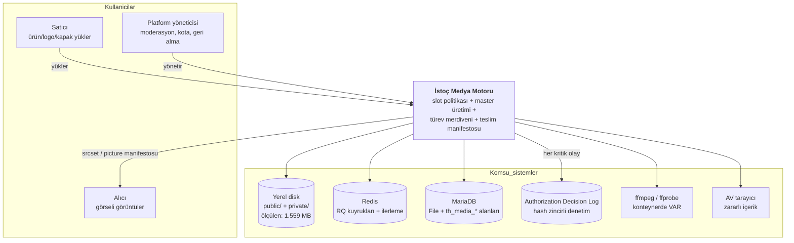
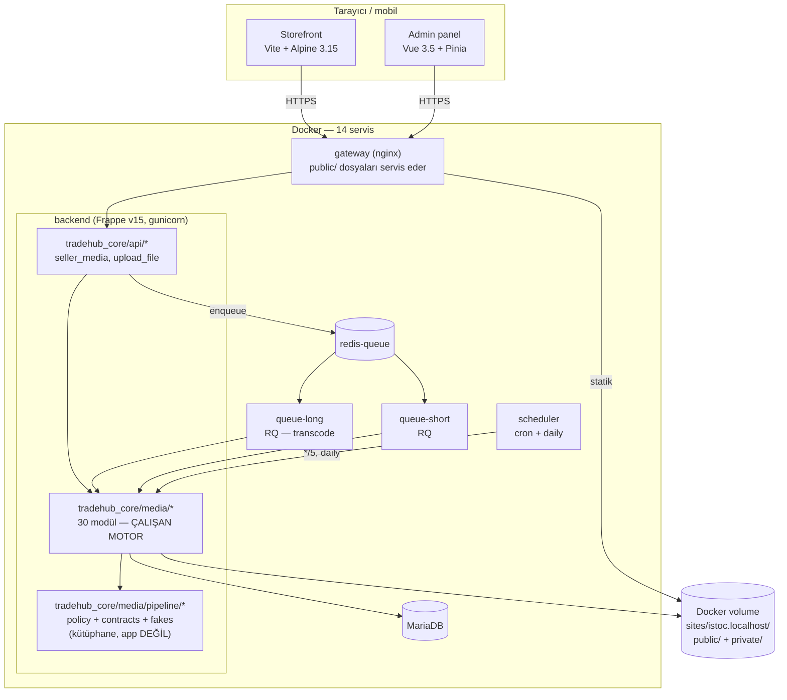
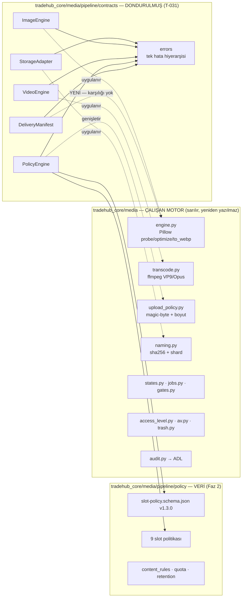
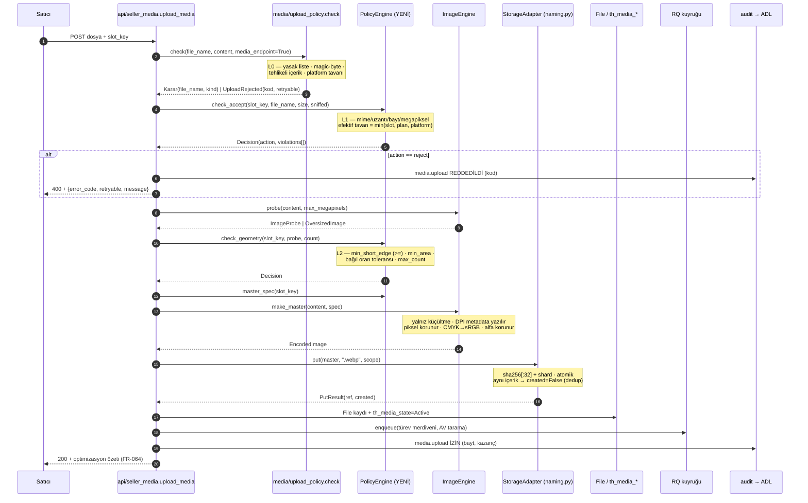
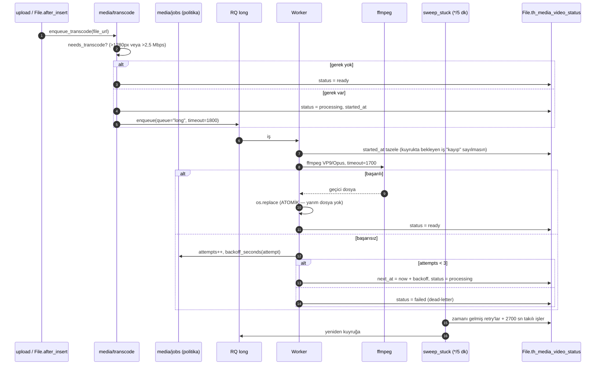
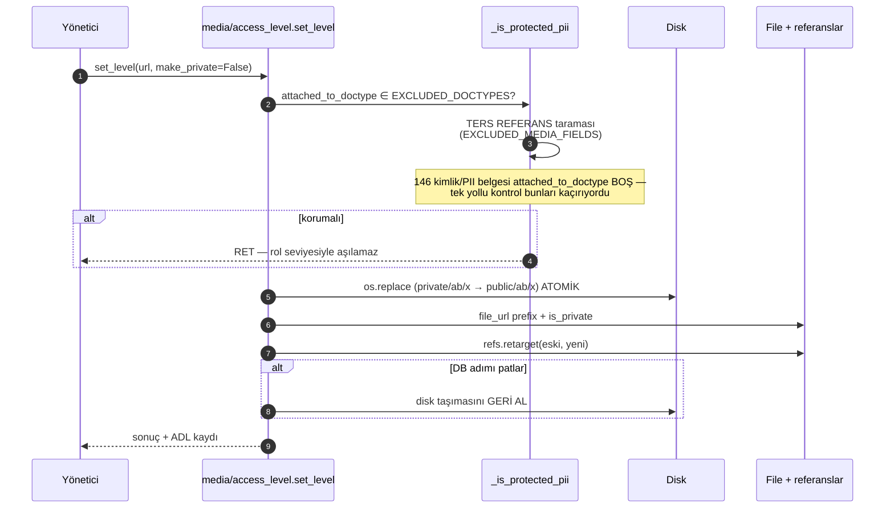
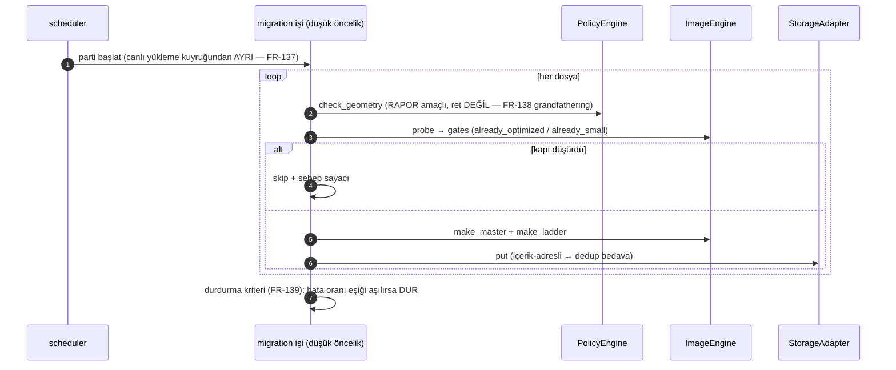
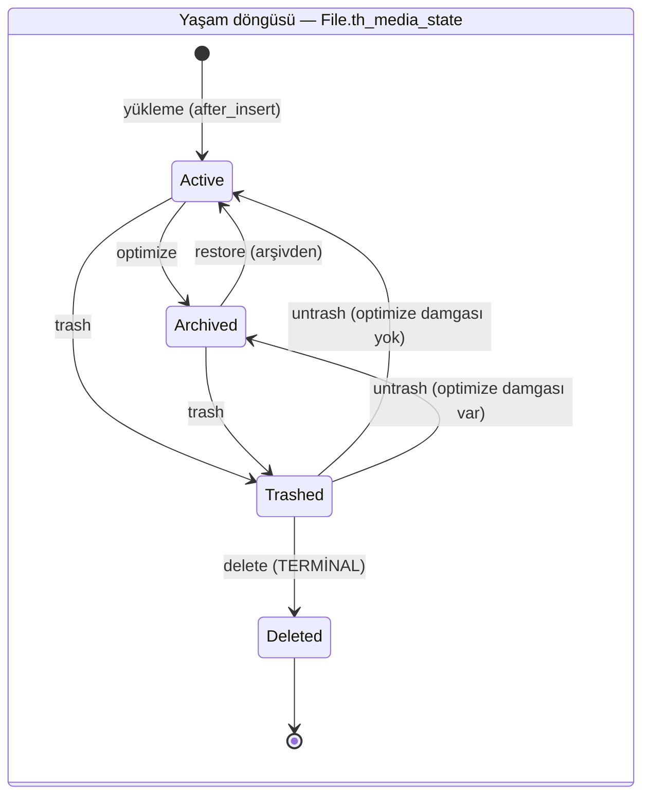
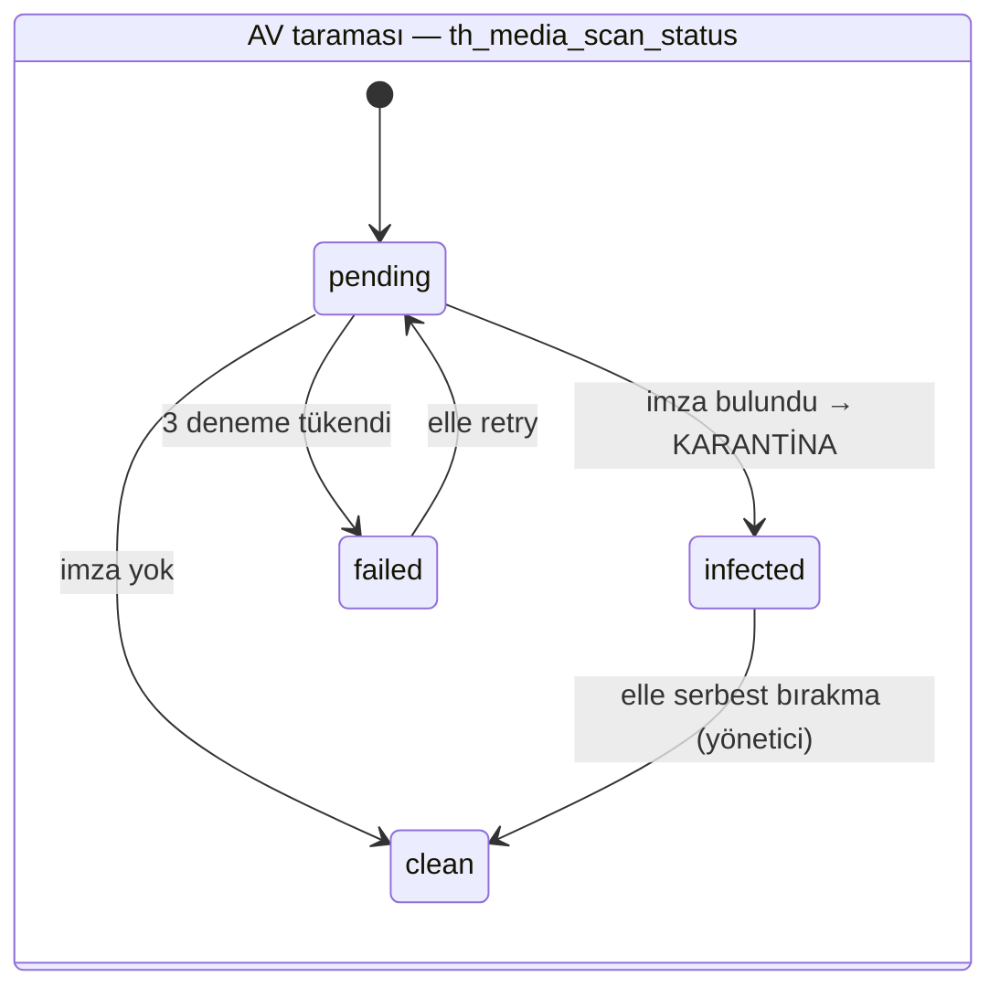
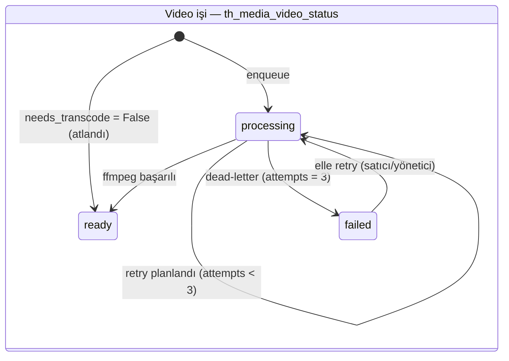

# SAD v1.0 — İstoç Medya Motoru Yazılım Mimari Dokümanı

**Durum:** TASLAK · **Faz:** 3 (Sistem mimarisi) · **Görev:** T-030
**Tarih:** 2026-08-18 · **Depo:** `tradehub_core` (dal: `ahmet`)
**Bağlı belgeler:** `docs/srs/SRS-v1.0.md` (142 FR + 52 NFR) ·
`docs/sad/interfaces.md` (T-031, dondurulmuş sözleşmeler) ·
`docs/standards/` (13 standart) · `docs/reports/` (13 rapor)

---

## 0. Bu belgenin kimliği

### 0.1 Neyi anlatır, neyi anlatmaz

Bu belge **çalışan bir sistemin nasıl büyüyeceğini** anlatır, sıfırdan bir
sistemin nasıl kurulacağını değil. İstoç'ta medya hattı bugün **üretimde
çalışıyor**: 30 modül, 4.958 dosya, 1.559 MB. Mimari kararların çoğu zaten
alınmış ve ölçülmüş; bu belgenin işi onları **görünür kılmak**, boşlukları
işaretlemek ve yeni katmanın (`tradehub_core/media/pipeline/`) nereye oturduğunu tanımlamaktır.

**Anlatmaz:** uygulama ayrıntısı (o `interfaces.md` ve kodda), kota/rate-limit
sayıları (o `docs/standards/kota.md`), slot eşikleri (o
`tradehub_core/media/pipeline/policy/slots/*.json`).

### 0.2 Ölçüm beyanı

Bu belgedeki her sayı ya **canlı ortamda ölçülmüştür** ya da **ölçülmüş
sayılardan aritmetikle türetilmiştir**; türetilen her sayının hesabı yanında
yazar. Ölçülemeyen her yer **ÖLÇÜLMEDİ** ile işaretlidir. Tahmin niteliğindeki
tek yer §9.3'tür ve orada açıkça "tahmin" der.

| Kaynak | Ne verdi |
|---|---|
| `docs/reports/02-medya-istatistigi.md`, `08-canli-olcum.md` | 4.958 dosya · 1.559 MB · MP dağılımı · mod dağılımı |
| `docs/reports/09-slot-bazinda-istatistik.md` | slot başına eşsiz dosya, uyum oranı, harici URL sayısı |
| `docs/reports/03-render-envanteri.md` | CSS kutuları, DPR hesapları, `srcset` yokluğu |
| `docs/reports/05-kutuphane-benchmark.md` (T-007) | Pillow / pyvips / ffmpeg süre + bellek ölçümü |
| `tradehub_core/media/pipeline/policy/slots/*.json` (Faz 2) | profil merdivenleri — türev nesne sayıları buradan **hesaplandı** |
| Kod okuması (`tradehub_core/media/*.py`) | bileşen sorumlulukları, hata davranışları, kuyruk politikası |

---

## 1. Sistemin bugünkü hâli — üç cümlelik özet

1. **Yükleme kapısı var ama slot körü.** `media/upload_policy.py` her yüklemeyi
   tek kapıdan geçiriyor (magic-byte + yasak liste + boyut) ama dosyanın hangi
   slota (ürün görseli mi, logo mu, KYB belgesi mi) ait olduğunu **bilmiyor**.
   Ölçülen sonucu: `product.image` yüklemelerinin **%48,6'sı**,
   `document.attachment`'ın **%91,8'i**, `category.banner`'ın **%100'ü** slot
   politikasına uymuyor.
2. **Master üretimi var, türev merdiveni yok.** `media/engine.py` görseli
   küçültüp yeniden sıkıştırıyor (biçim koruyarak) ama tek bir çıktı üretiyor.
   Ölçülen sonucu: `srcset` **31 görselin 0'ında**; ürün detay sayfası
   **13,14 MB** görsel indiriyor, hedef 900 KB — **15 katı**.
3. **Kuyruk ve durum makinesi olgun.** Video transcode, AV tarama, yedek ve
   çöp toplama işlerinin hepsi ortak retry politikası (`media/jobs.py`:
   3 deneme, 300/900 sn backoff, 2700 sn takılı eşiği) ve tek kapılı durum
   geçişi (`media/states.py`) üzerinde. **Bu katman yeniden yazılmayacak.**

Mimarinin görevi: (1) ve (2)'yi kapatmak, (3)'ü korumak.

---

## 2. Mimari kararlar ve kaynak dokümandan sapmalar

### 2.1 S-01 — medya motoru (kaynak dokümanın adıyla `media_engine`) ayrı bir Frappe app'i DEĞİL, kütüphanedir

> Adlandırma düzeltmesi: repoda `media_engine` diye bir dizin hiç olmadı; kütüphanenin
> gerçek yolu `tradehub_core/media/pipeline/`dır. Bu belgedeki `media_engine` kalıntıları
> bu revizyonda gerçek yola çevrildi — SAD-G1'in belge yarısı (2026-08-20 ölçümü: rapor 88).

**Kaynak doküman ne diyor:** Faz 3 görev listesi (T-032) "Frappe app iskeleti
ve modül yapısı" diyor ve tasarım boyunca `media_engine`'i **ayrı bir Frappe
app'i** olarak konumluyor.

**İstoç'ta ne var:** Medya, `tradehub_core` app'i **içinde** bir modül
(`tradehub_core/media/`, 30 dosya). Hooks, DocType alanları (`th_media_*`),
zamanlanmış görevler, ADL denetim kaydı — hepsi `tradehub_core`'a bağlı.

**Karar:** `tradehub_core/media/pipeline/`, `tradehub_core`'un **YANINDA duran saf bir Python
kütüphanesidir**. Ayrı app değildir; `apps/` altına kurulmaz, `hooks.py`'si
yoktur, DocType tanımlamaz.

```
tradehub_core/                  ← Frappe app (repo kökü)
├── tradehub_core/              ← app paketi — ÜRETİM, bu çalışmada SALT OKUNUR
│   ├── media/                  ← çalışan 30 modüllük motor
│   └── hooks.py
├── tradehub_core/media/pipeline/               ← YENİ: saf kütüphane, Frappe app DEĞİL
│   ├── policy/                 ← Faz 2: şema + 9 slot politikası (veri)
│   ├── contracts/              ← Faz 3 / T-031: 5 Protocol + hata hiyerarşisi
│   └── fakes/                  ← Faz 3 / T-031: bellek-içi sahte uygulamalar
├── docs/                       ← SRS, SAD, standartlar, raporlar
└── tradehub_core/tests/        ← sözleşme + politika testleri (repo kökünde ayrı `tests/` YOK — 2026-08-20 ölçümü: rapor 88)
```

**Gerekçe — dört madde, üçü ölçülebilir:**

| # | Gerekçe | Kanıt |
|---|---|---|
| G1 | **Ayrı app, veriyi ikiye böler.** `File` DocType'ı, `th_media_state`, `th_media_video_status`, `th_media_transcode_attempts` alanları `tradehub_core`'a ait. Ayrı app bu alanları ya çoğaltır ya cross-app bağımlılık kurar. | `tradehub_core/media/states.py`, `transcode.py` alan kullanımı |
| G2 | **Ayrı app, tek kapı kuralını kırar.** NFR-015: *her* yükleme yolu aynı `check()`'ten geçmeli. `hooks.py`'deki `write_file`, `File.after_insert` ve `before_insert` kancaları tek app'te toplanmalı; iki app'te sıra garanti edilemez. | `tradehub_core/hooks.py:268-271, :899` |
| G3 | **Kütüphane olmak test edilebilirliği ARTIRIR.** Bugünkü en değerli mimari kısıt `media/engine.py` ve `media/gates.py` içinde `import frappe` **olmamasıdır** — site kurmadan test edilebiliyorlar. `tradehub_core/media/pipeline/` bu kısıtı tüm pakete genişletir. Kanıt: `tests/test_contracts.py` 69 testi frappe/Pillow/ffmpeg **olmadan** koşuyor. | Bu çalışmada koşuldu (§0.2) |
| G4 | **Geri dönüş açık.** Kütüphane → app dönüşümü tek yönlü değildir: `tradehub_core/media/pipeline/` bir gün ayrı app olması gerekirse `hooks.py` + `modules.txt` eklenerek app'e terfi eder. Tersi (app'i modüle indirmek) migration gerektirir. | — |

**Sapmanın bedeli (dürüstlük payı):** `tradehub_core/media/pipeline/` ayrı app olmadığı için
başka bir Frappe kurulumuna tek başına kurulamaz; yeniden kullanılabilirlik
`pip install`'a değil dosya kopyalamaya kalır. Bu bedel bilinçli kabul edildi:
İstoç dışında bir tüketici **yok** ve olsaydı bile `policy/` + `contracts/`
kısmı zaten saf veri + saf tip, kopyalanabilir.

### 2.2 Diğer sapmalar

| # | Kaynak doküman | İstoç kararı | Gerekçe |
|---|---|---|---|
| **S-02** | pyvips ile yüksek performanslı işleme | **Pillow'da kalınır** | T-007 ölçümü: pyvips kutudan çıktığı hâliyle **0,94× (YAVAŞ)**; yalnız >15 MP'de (korpusun %3,7'si) kazanıyor, CMYK'de **0,37×–0,56×** ile rengi bozarak kaybediyor. `docs/reports/05-kutuphane-benchmark.md` §4.1, §4.3 |
| **S-03** | Yeni bir medya DocType ailesi | ~~**Yeni DocType açılmaz**~~ **KARAR ÇÜRÜDÜ** — bugün repoda **13 medya DocType'ı** var (`media_asset`, `media_version`, `media_rendition`, `media_processing_job`, `media_rum_sample`, `media_crop_intent`, `media_crop_override`, `media_folder`, `media_folder_item`, `media_profile`, `media_usage`, `media_engine_settings`, `media_storage_settings` — `tradehub_core/tradehub_core/doctype/` sayımı, 2026-08-20 ölçümü: rapor 88). Kararın denetim yarısı geçerli kaldı: denetim hâlâ ADL'ye yazılır, terk gerekçesi hiçbir belgede bulunamadı (rapor 30 §3) |
| **S-04** | Türevler için ayrı `File` kayıtları | **`File` kaydı AÇILMAZ** | Kotayı 6–12 kat şişirir. Mevcut emsal: arşivlenen orijinaller de `File` kaydı açmıyor (`media/presets.py:ARCHIVE_DIRNAME`). Karar `company-cover-video.json` `rendition_policy` içinde de kayıtlı |
| **S-05** | Nesne deposu (S3 vb.) | **Yerel disk üretimde korunur; S3/MinIO adaptörü YAZILDI, varsayılan kapalı** | ADR-0015: `storage/s3.py` + mirror/tiered yazıldı, üretimde kapalı; gerçek MinIO'ya karşı 91 kabul testi koştu (rapor 23). MinIO kabulü bugün W7-4'te yeniden koşuyor — sonuç için W7-4 raporuna bakın (2026-08-20 ölçümü: rapor 88) |
| **S-06** | Senkron içerik moderasyonu | **Asenkron** | FR-055; NFR-005 senkron yolda gecikme eklenmemesini istiyor |

### 2.3 Karar → mimari izlenebilirliği

| Karar | Mimaride nerede görünür |
|---|---|
| S-01 kütüphane | §2.1 dizin ağacı · §3.2 C4-2 (`tradehub_core/media/pipeline` ayrı konteyner DEĞİL, `backend` içinde kutu) |
| S-02 Pillow | §4 `ImageEngine` satırı "ölçek sınırı" kolonu · §9.2 |
| S-03 denetim ADL'de | §3.3 · §4 `AuditSink` satırı |
| S-04 türevde `File` yok | §9.3 depolama hesabı · §10.2 disk düzeni |
| S-05 disk | §4 `StorageAdapter` "bağımlılık" kolonu |
| S-06 asenkron moderasyon | §5.2 sıra diyagramı · §7.2 kuyruk tablosu |

---

## 3. C4 diyagramları

### 3.1 Seviye 1 — Sistem bağlamı



### 3.2 Seviye 2 — Konteynerler

`tradehub_core/media/pipeline` **ayrı bir konteyner değildir** (S-01): `backend` sürecinin
içinde çalışan bir kütüphanedir. Diyagram bunu bilerek gösterir.



### 3.3 Seviye 3 — `tradehub_core/media/pipeline` bileşenleri



**Okunacak tek şey:** `DeliveryManifest`'in mevcut motorda **karşılığı yok**.
Diğer dördü var olanın sözleşmeye kavuşturulmasıdır; teslim katmanı gerçekten
yeni koddur ve ölçülen 15× aşırı-servisin tek çözüm noktasıdır.

---

## 4. Bileşen sorumluluk tablosu

Her satır: **sorumluluk · bağımlılık · hata davranışı · ölçek sınırı**.

### 4.1 Yeni katman (`tradehub_core/media/pipeline/`)

| Bileşen | Sorumluluk | Bağımlılık | Hata davranışı | Ölçek sınırı |
|---|---|---|---|---|
| **PolicyEngine** | Slot politikasını okur, L1/L2 kapı kararını verir, master + türev spec'lerini üretir, politikayı kendi kendine doğrular (D1–D5). **Somut sınıf protokolün 13/13 metodunu karşılıyor** (`isinstance` True, rapor 43); **TypeScript ikizi** panelde aynı `evaluate` yüzeyini koşuyor — **393/393 parite vektörü birebir** (mesaj metinleri dahil; 2026-08-20 ölçümü: rapor 77) | `policy/slots/*.json` · **frappe YOK, DB YOK, ağ YOK** | Bilinmeyen slot → `PolicyNotFound`; bozuk politika → `PolicyError` ve **hiçbir politika değişmez** (ya hep ya hiç) | 9 politika bellekte; `reload()` O(dosya sayısı). Politika sayısı 100'ü aşarsa önbellek stratejisi gözden geçirilir — bugün 9 |
| **ImageEngine** | Künye okuma, master üretimi, türev merdiveni, SSIM | Pillow (S-02) | `DecodeError` / `UnsupportedFormat` / `OversizedImage` / `EncodeError`. **Yarım çıktı asla dönmez** | **Bellek**: Pillow tepe RSS ölçüldü — 10 dosyalık ağır korpusta 588 MB (`pillow`), `draft()` ile 367 MB. Tek görsel tavanı `accept.max_megapixels_hard` ile sınırlanır (FR-143) |
| **VideoEngine** | ffprobe künyesi, rendition, poster, önizleme klibi | ffmpeg/ffprobe (konteynerde VAR) | ffprobe yok → `measured=False` (**hata değil**, NFR-043); ffmpeg düşerse `TranscodeFailed(attempts)` | ffmpeg 1700 sn < kuyruk 1800 sn. Eşzamanlılık `queue-long` worker sayısıyla sınırlı |
| **StorageAdapter** | İçerik-adresli yazma/okuma/taşıma, imzalı URL | Yerel disk (S-05) | `ObjectNotFound` / `StorageConflict`; `delete` idempotent | 256 shard. Bkz. §9.4 — hesaplanan dizin başına ~134 nesne |
| **DeliveryManifest** | `srcset`/`sizes`/`<picture>` + poster/altyazı manifestosu | PolicyEngine | Hiç profil yoksa `NoProfileAvailable` (boş `srcset` yazmaz) | Saf hesap; render başına O(profil sayısı) = en fazla 12 |
| **errors** | Tek hata hiyerarşisi, `(kod, retryable)` sözleşmesi | — | — | — |

### 4.2 Korunan katman (`tradehub_core/media/`) — sarılır, yeniden yazılmaz

| Bileşen | Sorumluluk | Bağımlılık | Hata davranışı | Ölçek sınırı |
|---|---|---|---|---|
| `upload_policy.py` | Tek yükleme kapısı: yasak liste, magic-byte, boyut, tehlikeli içerik | frappe | `UploadRejected` + `(kod, retryable)`; `frappe.local.response` yoksa sessizce devam eder | İçerik ilk baytlarına bakar — dosya boyutundan bağımsız |
| `naming.py` | `sha256(içerik)[:32]` ad + 2 hex shard; `write_file` hook'unun **iki çağrı yolu** | frappe | Hook patlarsa yükleme kırılır — bu yüzden iki yol da açıkça desteklenir | 256 shard (NFR-051) |
| `engine.py` | Pillow probe/optimize/to_webp — **`import frappe` YOK** | Pillow | `OptimizeResult(ok=False, reason=…)` — asla istisna sızdırmaz | §9.2 |
| `gates.py` | 6 optimizasyon kapısı — **`import frappe` YOK** | engine | `GateResult(passed, reason)` | Saf fonksiyon |
| `states.py` | Yaşam döngüsü tek kapısı (`transition`) | frappe | Tanımsız geçiş → `frappe.throw`; `after_insert` kancası **best-effort** (yüklemeyi engellemez) | Kayıt başına 1 UPDATE |
| `jobs.py` | Ortak kuyruk politikası: 3 deneme, (300, 900) sn, 2700 sn takılı eşiği | frappe.utils | — (saf politika) | `STALE_AFTER > kuyruk timeout` değişmezi |
| `transcode.py` | ffmpeg VP9/Opus, retry, dead-letter, süpürücü | ffmpeg, RQ `long` | Sert kill'de `except` çalışmaz → süpürücü toplar | Zaman aşımı merdiveni §7.3 |
| `av.py` | Zararlı içerik taraması, karantina, hold | AV tarayıcı | Tarayıcı yoksa güvenli tarafa | Süpürücü 5 dk |
| `access_level.py` | public ↔ private atomik taşıma + referans güncelleme | frappe, refs | Disk taşıması DB'den ÖNCE; DB patlarsa disk **geri alınır** | Referans başına UPDATE |
| `trash.py` / `archive.py` / `backup.py` | 30/30 gün geri alma + 14 set yedek | frappe, disk | `purge_expired` idempotent | Günlük cron |
| `usage.py` / `refs.py` | Kullanım izleme, kırık referans onarımı | frappe, DB | `find_dangling` limit'li | Tam tarama — 6.443 alan referansı ölçüldü |
| `audit.py` | Kritik olayları ADL'ye yazar | `tradehub_core/audit` | Yıkıcı işlem → dosya başına; toplu işlem → iş başına özet | ADL hash zinciri |
| `chunked.py` | Parçalı yükleme oturumları | disk | `CHUNK_ORDER` / `CHUNK_MISSING` **retryable** | Oturum temizliği saatlik |

---

## 5. Akış diyagramları

### 5.1 Yükleme — senkron yol (görsel)



**Kritik sıra kuralı:** `PolicyEngine` kararı **diske yazmadan önce** verilir
(FR-072). Bugünkü kota kontrolü `File.before_insert`'te, yani **yazdıktan
sonra**; rollback `File` kaydını geri alır ama `os.write`'ı geri almaz →
**yetim dosya**. Ölçülen: **1.166 yetim disk dosyası**. Yeni akış bu kapıyı
öne çeker.

> **Üretimdeki gerçek akış — M-09'un belge yarısı (2026-08-20 ölçümü: rapor 88).**
> Yukarıdaki diyagram hedef akıştır; bugün üretimde türev üretimini tetikleyen yol
> `File.after_insert` → `pipeline_bridge.maybe_generate_renditions` kancasıdır
> (`hooks.py:350`), slot `bound_to`'dan sunucuda türetilir. Sürüm kimliği artık
> kütüphanenin **4 girdili** `dedup.version_hash(source_hash, policy_snapshot,
> crop_intent, engine_version)`'ından üretiliyor (rapor 57'deki "üretim kendi tek
> girdili sürümünü kullanıyor" bulgusu **kapandı** — rapor 64); her üretim bir
> `Media Version` kaydı açar (autoname UNIQUE `version_hash`, INV-06) ve türev
> dosyaları hash taşıyan adrese yazılır:
> `/files/media/{asset}/{version_hash}/{profil}-{genişlik}.{uzantı}` (INV-09).
> Eski adresli türevlere dokunulmadı; iki düzen yan yana yaşıyor (rapor 64 §1).

### 5.2 Video — asenkron yol



**Sert kill sorunu ve çözümü:** RQ zaman aşımı ya da OOM-killer worker'ı
vurduğunda `except` bloğu **hiç çalışmaz**; sayaç artmaz ve dosya sonsuza kadar
`processing` görünür. Bu yüzden retry kuyruğa **anında konmaz**, süpürücüye
devredilir — backoff ve sert kill tek mekanizmayla çözülür.

> **Video motorunun bugünkü gerçeği (2026-08-20 ölçümü: rapor 81).** Yukarıdaki
> diyagram eski `media/transcode.py` VP9/Opus hattını anlatır; yeni motor
> `media/pipeline/video/` **H.264/MP4 birincil** (ADR-0011) ve DEV'de **ilk gerçek
> koşumunu yaptı**: 4 gerçek video künyeden geçti (3 PASSTHROUGH, 1 REMUX),
> fayda kapısı INV-05 ilk kez gerçek çıktıyla tuttu (%11,44 ≥ %10), **VMAF ilk
> kez gerçekten ölçüldü: 89,34** (imaj artık libvmaf'lı, ffmpeg n8.1.2), poster +
> önizleme klibi + HLS merdiveni (3 basamak, 405 segment) üretildi ve HTTP 200.
> **Ama video için boru hattı YOK**: `pipeline_bridge` yalnız görsel işliyor;
> video kuyruk yolu, DocType kaydı ve manifest temsili bağlanmadı (rapor 81 §8).
> `vmaf_min=93` eşiği tabloda duruyor ama hiçbir kod uygulamıyor — karar için
> ADR-0021 (BEKLİYOR).

### 5.3 Erişim seviyesi değişimi (public ↔ private)



### 5.4 Teslim (render) — YENİ katman

```mermaid
sequenceDiagram
    autonumber
    participant SF as Storefront (Alpine)
    participant API as api/…listing
    participant DM as DeliveryManifest
    participant PE as PolicyEngine

    SF->>API: ürün detayı iste
    API->>DM: build_image("product.image", ref, intrinsic, is_lcp_candidate)
    DM->>PE: rendition_specs("product.image")
    PE-->>DM: 12 spec (96…1920 px, avif+webp)
    DM->>DM: türev URL'leri = aynı shard + "__<profil>.<biçim>"
    DM->>DM: üretilmemiş profilleri SÜZ (404 yazma)
    DM-->>API: RenderManifest{sources[], sizes, width, height, loading}
    API-->>SF: to_dict() — HTML DEĞİL, veri
    Note over SF: Alpine kendi şablonuna yazar;<br/>Vue admin panelinde aynı sözlüğü okur
```

> **Gerçek teslim yolu — M-10'un belge yarısı (2026-08-20 ölçümü: rapor 88).**
> Üretimdeki teslim ucu `api/media_manifest.py`'dir ve iki ucu **misafire açıktır**
> (`allow_guest=True` — `media_manifest.py:181` ve `:223`; herkese açık vitrin
> teslimi bilinçli). Toplu uç `manifest_batch` dosya bazlı çalışır ve yanıtta
> `version` anahtarı taşır (lqip/dominant_color/renk uzayı zenginleştirmesi —
> rapor 66/73). Bu yüzey artık **sözleşme altında**: `docs/api/openapi-http.yaml`
> **100 uç** (90 → 100, 10 ayrık uç kapatıldı), panelde `openapi-typescript` ile
> üretilmiş tipler + `client.ts` sarmalayıcı ve canlıya karşı contract testleri
> var (rapor 80).

### 5.5 Migration (geriye dönük standartlaştırma)



---

## 6. Durum makinesi

Medyada **üç bağımsız eksen** var. Tek bir "durum" alanına sıkıştırılmadılar
çünkü farklı soruları yanıtlıyorlar ve birbirlerinden bağımsız ilerliyorlar.







### 6.1 Geçiş tablosu — yaşam döngüsü

| Kaynak | Hedef | Tetik | Ön koşul | Yan etki |
|---|---|---|---|---|
| — | `Active` | `File.after_insert` | `is_folder=0` **ve** durum BOŞ | `th_media_state=Active` |
| `Active` | `Archived` | optimize | 6 kapının hepsi geçti | orijinal `image_originals/`'a, `th_optimized_at` |
| `Archived` | `Active` | geri al | arşiv 30 gün içinde | orijinal geri yazılır |
| `Active` | `Trashed` | çöpe at | 5 silme kapısı | dosya `media_trash/`'a, `th_trashed_at` |
| `Archived` | `Trashed` | çöpe at | aynı | aynı |
| `Trashed` | `Active` | geri al | 30 gün içinde | `th_optimized_at` BOŞ ise |
| `Trashed` | `Archived` | geri al | 30 gün içinde | `th_optimized_at` DOLU ise |
| `Trashed` | `Deleted` | kalıcı sil | çöpte olmalı | `File` silinir; durum **yalnız ADL'de** yaşar |
| `Active` | `Deleted` | — | **YASAK** | tek tıkla geri dönüşsüz sonuç engellenir |

**Neden `Deleted` diskte saklanmaz:** kaydı olmayan dosyanın durumu da olmaz.
O bilgi `media.delete` denetim kaydında durur.

**Yedekten geri yüklemenin tuzağı (yaşandı):** `after_insert` durumu ezmeye
kalkarsa çöpteki bir dosya yedekten `Active` döner ve çöp süresini atlayıp
listeye sızar. Bu yüzden kanca **dolu durumu ezmez**.

---

## 7. Kuyruk tasarımı

### 7.1 İlke

Medyada dört arka plan işi var ve üçü kendi durum sözlüğünü kullanıyordu.
`media/jobs.py` **ortak sözlüğü ve retry politikasını tek yerde** tanımlar;
işler kendi taşıma katmanını (DB alanı / Redis / disk) korur, yalnız **anlamı**
paylaşır. Yeni katman bu politikayı **yeniden yazmaz**, kullanır.

### 7.2 Kuyruk envanteri

| İş | Kuyruk | Taşıma (durum nerede) | Tetik | Idempotency muhafızı |
|---|---|---|---|---|
| Video transcode | `long` | `File.th_media_video_status` (kayıt başına) | upload + `File.after_insert` | durum `processing`/`ready` ise no-op |
| AV tarama | `short` | `File.th_media_scan_status` | `File.after_insert` | aynı desen |
| Görsel optimize (toplu) | `long` | Redis ilerleme sözlüğü (iş başına) | yönetici/migration | iş anahtarı (`job_key`) |
| Türev merdiveni (**YENİ**) | `long` | içerik-adresli anahtarın **varlığı** | master yazıldıktan sonra | `StorageAdapter.exists()` — durum alanı gerekmez |
| Yedek paketleme | `long` | disk üstünde durum dosyası | günlük cron | set kimliği |
| Süpürücüler | cron `*/5` | — | `hooks.py` scheduler | tarama idempotent |
| Saklama/purge | cron `daily` | — | scheduler | `purge_expired` idempotent |

**Türev merdiveninin durum alanı yok — bilinçli.** Çıktı içerik-adresli
olduğu için "üretildi mi" sorusu depoya bakılarak yanıtlanır. Yeni bir
`th_media_*` alanı açmak, aynı bilgiyi ikinci bir yerde tutmak olurdu (NFR-046).

> **Bu paragraf üretim gerçeğiyle çelişiyor — M-07 (2026-08-20 ölçümü: rapor 88).**
> Üretimdeki türev merdiveni `Media Processing Job` DocType'ında **tam durum
> makinesi** tutuyor (`idempotency_key` UNIQUE) ve her üretim `Media Version`
> kaydı açıyor (rapor 55 ölçümü + rapor 64). "Durum alanı gerekmez" kararı fiilen
> terk edildi; terk gerekçesi ADR'ye bağlanmadı. Tablodaki satır tarihsel niyeti
> anlatır, bugünü değil.

### 7.3 Politika sayıları ve değişmezleri

```
MAX_ATTEMPTS      = 3            (ilk çalıştırma dahil)
BACKOFF_SECONDS   = (300, 900)   (1. tekrar 5 dk, 2. tekrar 15 dk)
STALE_AFTER       = 2700 sn      (bu kadar "çalışıyor" görünen iş kayıp)
SWEEP_EVERY       = 300 sn       (backoff çözünürlüğünün alt sınırı)
```

**Zaman aşımı merdiveni — her katman bir üstünden KISA olmalı:**

```
ffprobe 20 sn  <  ffmpeg 1700 sn  <  RQ kuyruk 1800 sn  <  kayıp eşiği 2700 sn
```

| Değişmez | Neden | İhlalin sonucu |
|---|---|---|
| `STALE_AFTER > kuyruk timeout` | — | Hâlâ çalışan uzun transcode "kayıp" ilan edilir, **iki worker aynı dosyayı yazar** |
| `SWEEP_EVERY <= min(BACKOFF)` | Backoff çözünürlüğü süpürme periyodundan ince olamaz | 60 sn'lik backoff gerçekte 300 sn'de işlenir — sessiz yanlışlık |
| `ffmpeg timeout < kuyruk timeout` | Hata KENDİ katmanında yakalansın | RQ sert kill eder, sayaç artmaz, dosya sonsuza kadar `processing` |
| Retry kuyruğa anında konmaz | Backoff + sert kill tek mekanizmayla | Üç hak saniyeler içinde yanar |

---

## 8. SPOF analizi

Ölçüt: **bu bileşen düşerse ne durur, veri kaybı olur mu, kendiliğinden
toparlanır mı.**

| # | Tek hata noktası | Düşerse ne olur | Veri kaybı | Bugünkü azaltım | Önerilen azaltım | Öncelik |
|---|---|---|---|---|---|---|
| **SPOF-1** | **Yerel disk (tek volume)** | Tüm medya erişilemez; yükleme ve teslim durur | **EVET** — yedek yaşından geriye | Günlük içerik-adresli yedek, 14 set (`media/backup.py`) | Yedeği **başka bir hacme/host'a** çıkar; `verify(deep=True)` haftalık koş | **YÜKSEK** |
| **SPOF-2** | **MariaDB** | `File` kayıtları okunamaz; disk dolu ama sistem "dosya yok" der | Hayır (disk sağlam) | Frappe standart yedeği | Disk↔DB uzlaştırmasını cron'a bağla (FR-107) — bugün **1.166 yetim dosya** var | **YÜKSEK** |
| **SPOF-3** | **Redis (kuyruk)** | Transcode/AV/türev işleri kuyruğa girmez; **senkron yol çalışmaya devam eder** | Hayır | Süpürücüler durumu DB'de tuttuğu için Redis dönünce iş kaldığı yerden devam eder | Redis kalıcılığı (AOF) doğrula — **ÖLÇÜLMEDİ** | ORTA |
| **SPOF-4** | **`queue-long` worker'ı** | Video ve türev üretimi birikir; yükleme kabul edilir ama "işleniyor" kalır | Hayır | 5 dk süpürücü, 3 deneme, dead-letter | Worker sayısını ölç ve **kuyruk derinliği alarmı** ekle (NFR-039) | ORTA |
| **SPOF-5** | **ffmpeg/ffprobe imajdan kalkması** | Video hattı tamamen durur | Hayır | `FileNotFoundError` yakalanıyor, worker çökmüyor; `needs_transcode` güvenli tarafa düşer | İmaj sağlık kontrolüne `ffprobe -version` ekle | ORTA |
| **SPOF-6** | **AV tarayıcı** | Tarama `pending`de birikir | Hayır | `scanner_available()` kontrolü + karantina ayrı kök | Tarayıcı yoksa **servis edilebilirlik** kararını açıkça logla | ORTA |
| **SPOF-7** | **`write_file` hook'u (naming.py)** | **HER içerikli yükleme kırılır** — iki çağrı yolundan biri desteklenmezse | Hayır | İki yol da açıkça destekleniyor (fix round 1'de kırılmıştı) | Hook'un iki yolunu da kapsayan smoke test CI'a | **YÜKSEK** |
| **SPOF-8** | **Tek politika seti belirsizliği** | `tradehub_core/media/pipeline/policy/slots/` ile `docs/standards/policies/` **aynı anda** duruyor; hangisi yürürlükte belirsiz (FR-147) | Hayır | — | `PolicyEngine.source_root()` raporlanıyor; **tek kök seçilip diğeri türetilmeli** | **YÜKSEK** |
| **SPOF-9** | **nginx gateway** | Public dosyalar servis edilmez; API ayakta | Hayır | — | Statik teslim yolunu izle (Frappe'ye düşmesin) | DÜŞÜK |
| **SPOF-10** | **`Authorization Decision Log` yazımı** | Denetim kaydı düşer | Denetim izi | Yazma best-effort; işlemi engellemez | Yazılamayan denetimi ayrı bir sayaçla say — sessiz kayıp olmasın | ORTA |

**Kasıtlı olarak SPOF olmayanlar:** `ImageEngine` (saf fonksiyon, worker
başına bağımsız), `PolicyEngine` (salt okunur veri), `DeliveryManifest` (saf
hesap). Üçü de yatay ölçeklenir çünkü paylaşılan durumları yoktur.

---

## 9. Ölçek hesapları

### 9.1 Bugünkü büyüklük (ÖLÇÜLDÜ)

| Ölçüt | Değer |
|---|---|
| Dosya | 4.958 (4.350 public · 608 private) |
| Toplam boyut | 1.559 MB |
| Görsel / video | 4.812 / 23 |
| Biçim | JPEG %75,5 · PNG %16,3 · WEBP %8,0 · TIFF %0,2 |
| Mod | RGB 4.096 · RGBA 597 · CMYK 38 · P 74 · L 7 |
| Megapiksel | p50 **1,56** · p90 **5,01** · p99 **29,21** · maks **72,71** |
| Kısa kenar | p50 1.120 · p90 2.160 · p99 4.480 |
| Anomali | 179 dosya >20 MP · 38 CMYK · 597 alfa · **1.166 yetim disk dosyası** |
| `th_media_width` dolu | **0 / 2.853 (%0)** — çözünürlük metadatası hiç yazılmıyor |
| Alan referansı | 6.443 (eşsiz URL 3.239; **719'u harici URL**) |

### 9.2 İşleme maliyeti (T-007 ölçümünden)

Ölçülen korpus **bilerek ağır** seçilmiş 10 dosya (1,4–72,7 MP). Bu yüzden
toplam süreyi 4.812 dosyaya **doğrudan çarpmak yanlış olur**; hesap dosya
başına ölçülen değerlerle yapılır.

| Boyut sınıfı | Ölçülen süre (JPEG çıktı, `pillow_draft`) | Korpustaki payı |
|---|---|---|
| 1,4 MP | **19 ms** | p50 = 1,56 MP → tipik dosya bu bandın hemen üstünde |
| 1,7 MP | **47 ms** | — |
| 6,3 MP | **172 ms** | ~p90 (5,01 MP) civarı |
| 18,3 MP | **727 ms** | p99 altı |
| 36,3 MP | **1.951 ms** | 179 dosyalık >20 MP kümesi |
| 72,7 MP | **474 ms** (JPEG, `draft()` kazanıyor) | maksimum tek dosya |

**Türetilen alt sınır (aritmetik, tahmin değil):** p50 bandındaki bir dosya
19–47 ms sürüyorsa, 4.812 görselin **master üretimi** tek çekirdekte
`4.812 × 0,047 sn ≈ 226 sn ≈ 3,8 dakika` alt sınırındadır. Bu **alt sınırdır**:
p90 üstü dosyalar bandı yukarı çeker ve türev merdiveni master'ın üstüne gelir.
Gerçek migration süresi **ÖLÇÜLMEDİ** — parti koşumu yapılmadı.

**Bellek tavanı (ÖLÇÜLDÜ):** Pillow tepe RSS 588 MB, `draft()` ile **367 MB**.
Bu, `queue-long` worker başına ayrılması gereken bellektir; eşzamanlı worker
sayısı `toplam_bellek / 0,6 GB` ile sınırlıdır.

**Kapı 4 etkisi:** en uzun kenarı tavanı **aşmayan** dosya hiç işlenmez. Önceki
korpus ölçümü (4.007 dosya, `GORSEL-OPTIMIZASYON.md` §8): yalnız **~300 dosya**
bu kapıyı geçiyordu. Bugünkü 4.958'lik korpus için bu oran **yeniden
ÖLÇÜLMEDİ**.

### 9.3 Depolama — türev merdiveni

Türev nesne sayıları **politikadan hesaplandı** (profil × biçim), yerel dosya
sayıları `docs/reports/09-slot-bazinda-istatistik.md` §uyum tablosundan alındı
(eşsiz dosya − harici URL).

| Slot | Türev/master | Profil genişlikleri | Yerel dosya | Türev nesnesi |
|---|---:|---|---:|---:|
| `product.image` | **12** | 96 · 192 · 384 · 640 · 768 · 1280 · 1920 (avif+webp) | 2.393 | **28.716** |
| `company.cover_image` | 10 | 768 · 1000 · 1280 · 1920 · 2560 | 34 | 340 |
| `seller.logo` | 5 | 64 · 128 · 256 · 512 · 1200 | 19 | 95 |
| `document.attachment` | 1 | 512 | 61 | 61 |
| `product.video` | 3 | 192 · 1024 | 5 | 15 |
| `category.banner` | 6 | 480 · 960 · 1920 | 2 | 12 |
| `company.cover_video` | 3 | 192 · 854 · 1280 | 2 | 6 |
| `user.avatar` | 3 | 96 · 160 · 256 | 0 | 0 |
| `brand.logo` | 5 | 64 · 128 · 256 · 512 · 1200 | **ÖLÇÜLMEDİ** | ÖLÇÜLMEDİ |
| **Toplam** | | | | **≈ 29.245** |

**Piksel oranı (hesaplandı):** `product.image` için tüm türevlerin piksel
toplamı master'ın **2,255 katıdır**
(`Σ (profil_genişliği / 2400)²` = 2,255; avif ve webp ayrı nesne sayıldı).

**Bayt karşılığı — TAHMİN, ÖLÇÜLMEDİ.** Bayt ∝ piksel varsayımı yanlıştır:
avif aynı ölçüde webp'ten belirgin küçüktür ve küçük türevlerde başlık payı
büyür. Gerçek bayt maliyeti ancak merdiven bir örneklem üzerinde
üretildikten sonra ölçülebilir. Bu ölçüm **Faz 4'ün kabul kriteri olmalıdır**.

### 9.4 Dizin dağılımı (NFR-051)

```
toplam nesne ≈ 4.958 orijinal + 29.245 türev = 34.203
shard sayısı  = 256   (adın ilk 2 hex karakteri)
shard başına  ≈ 134 nesne
```

134 nesne/dizin, hiçbir dosya sistemi için sorun değildir. Sharding **on kat
büyümede bile** (≈1.340/dizin) rahat.

### 9.5 Teslim kazancı hedefi

| Ölçüt | Bugün (ÖLÇÜLDÜ) | Hedef | Kaynak |
|---|---|---|---|
| Ürün detay sayfası görsel yükü | **13,14 MB** | 900 KB | `docs/reports/03-render-envanteri.md` |
| `srcset` kullanan görsel | **0 / 31** | tümü | aynı |
| En büyük tek görsel | 32,5 MP / 2,35 MB | master tavanı 2400 px → 5,76 MP | `product-image.json` |
| Aşırı-servis oranı | **≈15×** | `max_overshoot` 1,85 | `product-image.json` `profiles[].max_overshoot` |

`DeliveryManifest.overshoot()` bu oranı **sunucuda hesaplanabilir** kılar;
"azaldı" iddiası ölçülemeyen bir temenni olmaktan çıkar (FR-123).

---

## 10. Veri akışı ve depolama düzeni

### 10.1 Adresleme

```
ad     = sha256(içerik)[:32] + uzantı        ← naming.py, DEĞİŞMEZ
shard  = adın ilk 2 hex karakteri            ← 256 dizin
url    = /files/<shard>/<ad>                 (public)
       = /private/files/<shard>/<ad>         (private)
türev  = /files/<shard>/<ad-gövdesi>__<profil>.<biçim>
```

Türev **aynı shard'da** durur (FR-040): ad değişmeyen bir hash ile başladığı
için shard korunur, dizin dağılımı bozulmaz ve orijinal ile türevi tek
`ls` ile görülebilir.

### 10.2 Kökler

| Kök | İçerik | Retention | `File` kaydı |
|---|---|---|---|
| `public/files/` | Servis edilen medya | — | VAR |
| `private/files/` | PII, belgeler, imzalı erişim | — | VAR |
| `private/image_originals/` | Optimizasyon öncesi orijinaller | 30 gün | **YOK** (kotayı şişirmesin) |
| `private/media_trash/` | Çöp | 30 gün | VAR (durum `Trashed`) |
| `private/media-backups/blobs/<xx>/` | İçerik-adresli yedek blob'ları | 14 set | YOK |
| karantina kökü | AV imzası bulunanlar | elle | VAR (servis EDİLMEZ) |
| **türevler** (YENİ) | `<shard>` içinde, orijinalin yanında | orijinalle aynı | **YOK** (S-04) |

---

## 11. Bilinen çatışmalar ve açık maddeler

| # | Konu | Durum |
|---|---|---|
| A-1 | **İki politika seti** yan yana: `tradehub_core/media/pipeline/policy/slots/` (9, şema uyumlu) ve `docs/standards/policies/` (T-024 testinin okuduğu). FR-147 tek set istiyor. | **AÇIK** — kanonik kök seçilmeli, diğeri türetilmeli |
| A-2 | **İki hata modülü**: `tradehub_core/media/pipeline/contracts/errors.py` (protokol seviyesi, `(kod, retryable)`) ve `tradehub_core/media/pipeline/core/errors.py` (kullanıcıya dönük, iki dilli mesaj + ipucu). İkisi çelişmiyor ama **birleştirilmeli**: `core/errors` sunum katmanı, `contracts/errors` taşıma katmanı olarak konumlanmalı. | **AÇIK** — Faz 3 kapanışında (T-035) karara bağlanmalı |
| A-3 | 9 politikanın **9'u da `draft`**. FR-005: `active` olabilmesi için `open_questions` boş + hiçbir `encoder_quality` null olmamalı. | **AÇIK** — `PolicyEngine.validate()` bugün 9 uyarı üretiyor, 0 ihlal |
| A-4 | `th_media_width` **0/2.853 dolu**. FR-133 video için, FR-030 görsel için ölçü metadatasının yazılmasını istiyor. | **AÇIK** — yazma noktası master üretimi olmalı |
| A-5 | **1.166 yetim disk dosyası**. FR-107 uzlaştırma istiyor. | **AÇIK** — cron işi yok |
| A-6 | Kota kontrolü diske yazdıktan **sonra** (`File.before_insert`); rollback `os.write`'ı geri almıyor → yetim üretiyor (FR-072). | **AÇIK** — §5.1 akışı bunu öne çekiyor |
| A-7 | `brand.logo` slotu için **yerel dosya sayısı ölçülmedi**; §9.3 toplamı eksik. | **ÖLÇÜLMEDİ** |
| A-8 | Migration parti koşumu yapılmadı; gerçek süre ve bayt kazancı **ölçülmedi**. | **ÖLÇÜLMEDİ** — Faz 4 kabul kriteri |

---

## 12. İzlenebilirlik — bileşen ↔ gereksinim

| Bileşen | Karşıladığı FR/NFR (özet) |
|---|---|
| **PolicyEngine** | FR-001…FR-018 (slot kimliği, kabul, geometri) · FR-027 · FR-032…FR-036 · FR-057 · FR-147 · FR-148 · FR-149 · NFR-045 · NFR-046 · NFR-047 |
| **ImageEngine** | FR-011 · FR-028…FR-031 · FR-037…FR-039 · FR-044 · FR-145 · FR-146 · NFR-011 · NFR-041 |
| **VideoEngine** | FR-041…FR-043 · FR-129 · FR-130 · FR-133 · FR-134 · NFR-003 · NFR-040 · NFR-043 |
| **StorageAdapter** | FR-040 · FR-045 · FR-112 · FR-113 · NFR-019 · NFR-020 · NFR-044 · NFR-050 · NFR-051 |
| **DeliveryManifest** | FR-121…FR-124 · FR-125…FR-128 (poster/altyazı taşır) · NFR-008 · NFR-028 · NFR-033 |
| **errors (sözleşme)** | FR-060 · FR-061 · FR-062 · FR-066 · FR-088 |
| **jobs / states (korunan)** | FR-092 · FR-093 · FR-108 · NFR-036 · NFR-040 · NFR-042 |
| **audit (korunan)** | FR-101 · FR-114 · FR-116 · NFR-034 · NFR-035 |
| **access_level (korunan)** | FR-109 · FR-110 · FR-115 · FR-116 · FR-117 · NFR-016 · NFR-018 |

---

## 13. Kabul kriteri karşılığı (T-030)

| # | Kriter | Karşılandığı yer |
|---|---|---|
| 1 | Bileşen, dağıtım, veri akışı ve durum diyagramları mermaid'de | §3.1 · §3.2 · §3.3 · §5.1–§5.5 · §6 |
| 2 | Her bileşen için sorumluluk, bağımlılık, hata davranışı, ölçek sınırı | §4.1 · §4.2 (tam tablo, 19 bileşen) |
| 3 | Her karar mimaride izlenebilir | §2.3 karar → bölüm haritası |
| 4 | Tek hata noktaları listeli, azaltımları yazılı | §8 (SPOF-1…SPOF-10, öncelikli) |

**Karşılanmayan:** yok. **Eksik ölçüm:** §11 A-7, A-8.

---

## 14. İnceleme sonucu ve revizyon geçmişi

> Bu bölüm T-030'un istediği **bağımsız mimari inceleme** tarafından eklendi.
> **Onay bloğu doldurulmamıştır**; imza insan kararıdır ve aşağıdaki kapılar
> kapanmadan atılamaz.

### 14.1 Revizyon geçmişi

| Rev | Tarih | Ne oldu | Durum |
|---|---|---|---|
| v1.0-taslak | 2026-08-18 | İlk yazım (T-030) | TASLAK |
| — | 2026-08-19 | **Bağımsız mimari inceleme** — `docs/reports/21-t030-mimari-inceleme.md` | TASLAK (değişmedi) |

### 14.2 İnceleme kararı

**SAD v1.0 bugün ONAYLANAMAZ.** Gerekçe: belge 2026-08-18'de yazıldı; ertesi gün
Dalga A medya boru hattını ürüne bağladı (5 DocType, 5. `File.after_insert`
kancası, misafire açık manifest ucu, bayrak katmanı, `Media Profile`
projeksiyonu) ve bu hattın hiçbir parçası bu belgede yok. Belgenin anlattığı
akışlar (§5.1, §5.4, §7.2) ise üretime bağlı değil.

**Bloklayıcı 8 bulgu** (ayrıntı ve `dosya:satır` kanıtları rapor 21'de):

| # | Konu | SAD'da |
|---|---|---|
| M-01 | §2.1 dizin ağacı gerçek olmayan bir yol gösteriyor; 6 satırda `media_engine` kalıntısı; `tests/` kökü yok | §2.1 |
| M-02 | `PolicyEngine` iki uyumsuz şey: `contracts/policy.py` Protocol (13 metot) ile `policy/engine.py` somut sınıf (2 metot). SAD'ın çağırdığı 7 metodun tek uygulaması **sahte** | §3.3 §4.1 §5.1 §5.4 §8 §11 |
| M-04 | **S-03 çürüdü** — 5 yeni DocType kuruldu | §2.2 §2.3 |
| M-07 | **§7.2 çürüdü** — türev merdiveni `Media Processing Job`'da tam durum makinesi tutuyor | §7.2 |
| M-09 | Üretimdeki türev akışı (`File.after_insert` → `pipeline_bridge`) belgede yok; slot `bound_to`'dan sunucuda türetiliyor | §5.1 |
| M-10 | Gerçek teslim yolu (`api/media_manifest`, **misafire açık**) belgede yok | §5.4 §3.1 §3.2 |
| M-14 | Taslak (`draft`) politikanın üretim kararına etkisi tanımsız (SRS G6 ↔ §6.2 çelişkisi) | §11 A-3 |
| M-18 | İçerik-adresli adlandırmanın çok-kiracılı erişim bedeli hiç yazılmamış | §10.1 §8 |

Ayrıca **§13'ün "Karşılanmayan: yok" ifadesi geçersizdir**: kriter 2 (her bileşen
için tam tablo) karşılanmamıştır — tablo `media/`'nin 33 modülünden 17'sini,
paketin 16 alt paketinden 6'sını kapsıyor ve Dalga A bileşenlerini
(`pipeline_bridge.py`, `pipeline_flags.py`, 5 DocType) hiç anmıyor.

### 14.3 Onay kapıları (SAD-G1…SAD-G8)

Bu belgenin kendi geçiş kapısı listesi yoktu (SRS §6.7'nin karşılığı).
İnceleme sekiz kapı öneriyor; tanımları ve kapatan bulguları
`docs/reports/21-t030-mimari-inceleme.md` §7'de:

| Kapı | Özet |
|---|---|
| SAD-G1 | Adlandırma ve dizin gerçeği düzeltilsin |
| SAD-G2 | Tek `PolicyEngine`'e inilsin ya da "uygulaması yok" işaretlensin |
| SAD-G3 | Bugünkü üretim hattı (Dalga A + manifest + bayraklar + projeksiyon) çizilsin |
| SAD-G4 | S-03 ve S-05 yeniden yazılsın |
| SAD-G5 | Taslak politika için mimari kural konsun |
| SAD-G6 | İçerik-adresli adlandırmanın çok-kiracılı bedeli yazılsın |
| SAD-G7 | İki backfill hattı + video fayda kapısı geri çekilme boşluğu belgeye girsin |
| SAD-G8 | §9.3 sayıları, A-1/A-4 ifadeleri ve §4 bileşen tablosu tazelensin |

### 14.4 İncelemenin doğruladığı bölümler (revizyonda korunmalı)

Aşağıdaki bölümler kodda birebir doğrulandı ve **değiştirilmemelidir**:
§4.2'nin 13 satırı · §5.3 PII akışı · §6 üç eksenli durum makinesi ve §6.1 geçiş
tablosu · §7.3 zaman aşımı merdiveni ve değişmezleri · §10.1 adresleme ·
§2.2'nin S-02, S-04, S-06 kararları.

**Durum bu revizyonda değişmedi: belge hâlâ TASLAK'tır.**

### 14.5 Kanıt ve kapı durumu — 2026-08-19 gün sonu ölçümü

> Bu alt bölüm **yalnız ölçüm kaydıdır**. Onay bloğu doldurulmamıştır, imza
> atılmamıştır, §1-§13 gövdesinde tek karakter değiştirilmemiştir.
> Ayrıntı ve komut çıktıları: `docs/reports/55-d2-faz3-5-kapanis.md`.

**8 bloklayıcının aynı gün ikinci ölçümü:**

| # | Bugün | Kanıt (ölçüldü) |
|---|:--:|---|
| M-01 | ❌ **AÇIK** | Gövdede `media_engine` hâlâ 6 satırda (66, 69, 102, 122, 167, 209); repo kökünde öyle bir dizin yok; `tests/` kökü yok (testler `tradehub_core/tests/`, 137 dosya) |
| M-02 | ✅ **KAPANDI** | Protokol ∩ somut sınıf: ∅ → **13/13**; `isinstance(PolicyEngine(), Proto)` **False → True**; `test_contracts` **69 → 75 OK** (yerel + konteyner); `policy/engine.py` 1817 satır, `NotImplementedError` **0** |
| M-04 | ❌ **AÇIK — sayı büyüdü** | Canlı `tabDocType`'ta **10** medya DocType'ı (6 → 8 → 10, aynı gün); §2.2 S-03 hâlâ "Yeni DocType açılmaz" diyor |
| M-07 | ❌ **AÇIK** | §7.2'nin satırı (`:555`) ve NFR-046 gerekçesi (`:560`) değişmedi; `Media Processing Job` kurulu, `idempotency_key` UNIQUE |
| M-09 | ❌ **AÇIK** | `hooks.py` `after_insert` 5. kancası (`pipeline_bridge.maybe_generate_renditions`) yerinde; §5.1 değişmedi |
| M-10 | ❌ **AÇIK** | `api/media_manifest.py:154` ve `:196` hâlâ `allow_guest=True`; §5.4 · §3.1 · §3.2 · §8 değişmedi |
| M-14 | ❌ **AÇIK** | 9/9 politika `draft`; `PolicyEngine.validate()` → **0 ihlal / 9 uyarı**; motor durumu `Decision.policy_status`'ta **raporluyor, kararı değiştirmiyor**; SAD'da kural yok |
| M-18 | ⚠ **YARI** | **Kod azaltımı geldi:** `tradehub_core/media/file_isolation.py` + `hooks.py:999` (`has_permission`) + `hooks.py:1042` (`override_doctype_class` → `TenantIsolatedFile`). **Belge tarafı boş:** §10.1'de bedel, §8'de risk satırı yok |

**İki şimdiki-zamanlı cümlenin ayrı ölçümü (SAD-G2'nin belge yarısı):**

| Yer | İddia | Bugün |
|---|---|---|
| §11 A-3 (`:748`) | *"`validate()` bugün 9 uyarı üretiyor, 0 ihlal"* | ✅ **Artık kelimesi kelimesine doğru ve koşturulabilir** — düzeltme gerekmiyor |
| §8 SPOF-8 (`:602`) | *"`PolicyEngine.source_root()` raporlanıyor"* | ⚠ **Yarı doğru** — metot var ve çalışıyor, ama `api/`, `media/*.py`, `patches/` içinde **çağıran yok**; hiçbir Frappe yüzeyi raporlamıyor |

**Kapı durumu:**

| Kapı | G1 | G2 | G3 | G4 | G5 | G6 | G7 | G8 |
|---|:--:|:--:|:--:|:--:|:--:|:--:|:--:|:--:|
| Durum | ❌ | ⚠ **yarı** | ❌ | ❌ | ❌ | ❌ (azaltım hazır) | ❌ | ❌ |

**Kapıya eklenen yeni madde (rapor 21'de ölçülmemişti):** `ImageEngine` ve
`VideoEngine` Protokollerini **yalnız sahte uygulamalar** karşılıyor; üretimdeki
`image/render.py` ve `video/transcode.py` fonksiyon modülüdür ve hiçbir sınıf
sözleşmeyi uygulamıyor. Bu, M-02'nin iki başka örneğidir; **SAD-G2 bu ikisi için
de bir karar ister** (üretim sarmalayıcısı ya da belgede "yalnız sözleşme"
işareti). Ölçüm: `StorageAdapter` 2 üretim + 1 sahte · `PolicyEngine` 1 + 1 ·
`DeliveryManifest` 1 + 1 · `ImageEngine` **0** + 1 · `VideoEngine` **0** + 1.

> **Karar: SAD v1.0 bugün de ONAYLANAMAZ.** 8 kapının 7'si açık.
> Buna karşılık açık 6 bloklayıcının **hiçbiri kod değişikliği istemiyor** —
> altısı da bu belgenin bugünkü hattı anlatmasıyla kapanır.

### 14.6 Doküman eşitlemesi — 2026-08-20 ölçümü (rapor 88)

Bu revizyon, 14.5'te açık kalan bloklayıcıların **belge yarılarını** kapattı;
her düzeltme gövdede `(2026-08-20 ölçümü: rapor NN)` etiketiyle işaretli.
Kod tarafına dokunulmadı.

| # | 14.5 durumu | Bugün | Ne yapıldı / kanıt |
|---|:--:|:--:|---|
| M-01 | ❌ AÇIK | ✅ **KAPANDI (belge)** | Gövdedeki 6 `media_engine` kalıntısı gerçek yola (`tradehub_core/media/pipeline/`) çevrildi; §2.1 ağacındaki `tests/` kökü `tradehub_core/tests/` oldu |
| M-02 | ✅ KAPANDI | ✅ **KAPALI + genişledi** | 13/13 protokol uyumu sürüyor (rapor 43); üstüne **TS ikizi** geldi: `evaluate` yüzeyi panelde, **393/393 parite** (rapor 77). `ImageEngine`/`VideoEngine` üretim uygulaması hâlâ 0 — SAD-G2'nin o yarısı AÇIK |
| M-04 | ❌ AÇIK | ✅ **KAPANDI (belge)** | §2.2 S-03 "karar çürüdü" olarak yeniden yazıldı: repoda **13 medya DocType'ı** sayıldı |
| M-07 | ❌ AÇIK | ✅ **KAPANDI (belge)** | §7.2'ye `Media Processing Job` + `Media Version` gerçeği not düşüldü |
| M-09 | ❌ AÇIK | ✅ **KAPANDI (belge)** | §5.1'e üretim akışı (`pipeline_bridge`, 4 girdili `version_hash`, INV-09 hash'li adres — rapor 64) eklendi |
| M-10 | ❌ AÇIK | ✅ **KAPANDI (belge)** | §5.4'e gerçek teslim yolu (`api/media_manifest`, misafire açık `:181`/`:223`, `manifest_batch` `version` anahtarı, OpenAPI **100 uç** — rapor 80) eklendi |
| M-14 | ❌ AÇIK | ❌ **AÇIK** | Taslak politikanın üretim kararına etkisi için mimari kural hâlâ yok — kural koymak KARAR işi, bu revizyon ölçüm/belge işiydi |
| M-18 | ⚠ YARI | ⚠ **YARI** | Kod azaltımı yerinde (`file_isolation.py` + `TenantIsolatedFile`); §10.1 bedel anlatımı hâlâ yazılmadı |

**Bu revizyonda ayrıca kayda geçen ölçümler:**

- **Video motorunun ilk gerçek koşumu** (rapor 81): VMAF **89,34** ölçüldü
  (eşik 93'ün altında, eşiği uygulayan kod yok) — karar ADR-0021'de BEKLİYOR;
  HLS basamağında fayda kapısı boşluğu ADR-0019 ile karara bağlandı (W7-1 ekliyor).
- **RUM zinciri**: `Media RUM Sample` DocType + `api/rum.collect` ucu canlıda
  (200/429 ölçüldü, rapor 63); uç OpenAPI-HTTP'ye girdi (rapor 80); storefront
  montajı hazır-ama-kapalı (`web-vitals` bağımlılık onayı bekliyor).
- **İzin modeli**: `Media Asset.owner_seller` üzerinden kiracı izolasyonu
  `permissions.py`'de kancalı (`:2627-2789`); `if_owner` DocPerm tuzağı
  kaldırıldı (`permissions.py:2066`, `patches/v15_3_6_fix_approval_if_owner_trap.py`).
- **Worker kaynak limitleri**: compose'ta `queue-long/short/scheduler` cgroup
  tavanları kondu — öncesi 0 limit ölçülmüştü (rapor 82).

**Durum: belge hâlâ TASLAK.** İmza insan kararıdır; SAD-G2 (üretim
Image/Video uygulaması), SAD-G5 (M-14) ve SAD-G6 (M-18 belge yarısı) açık.
